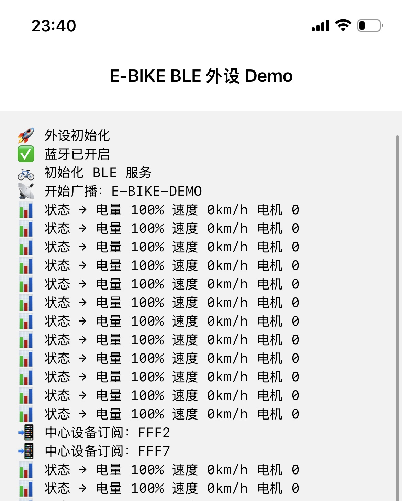
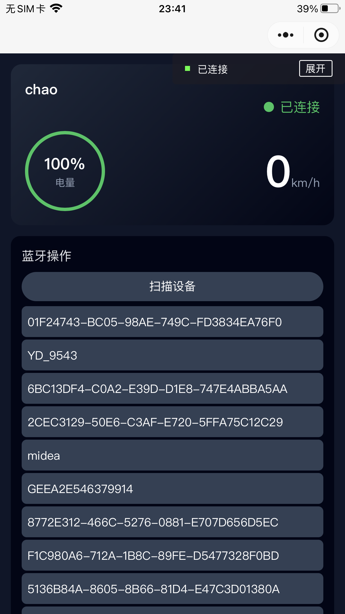
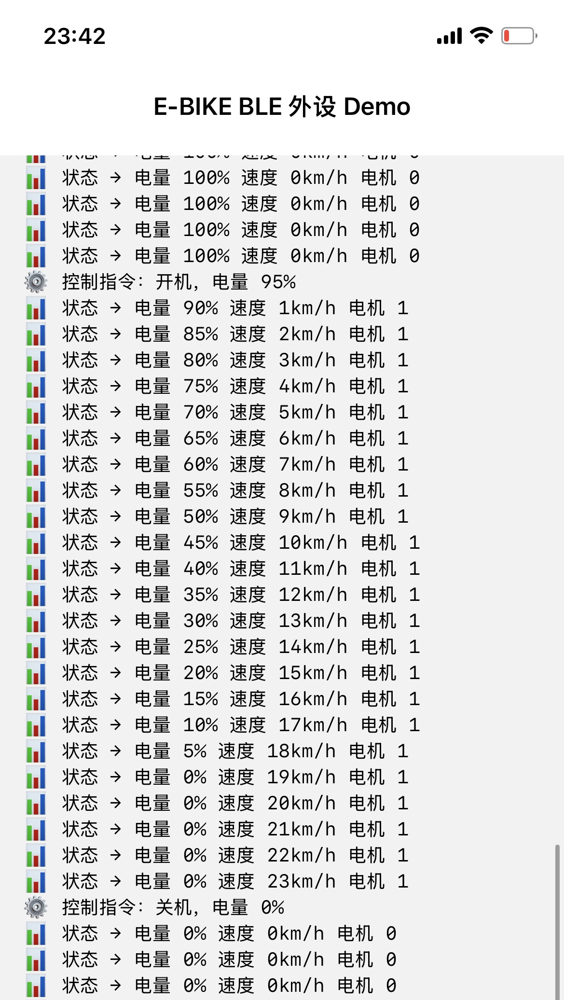
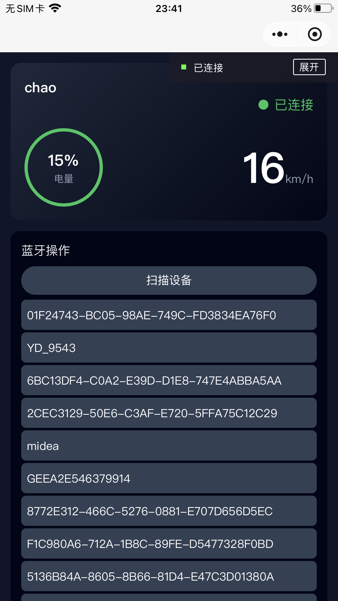
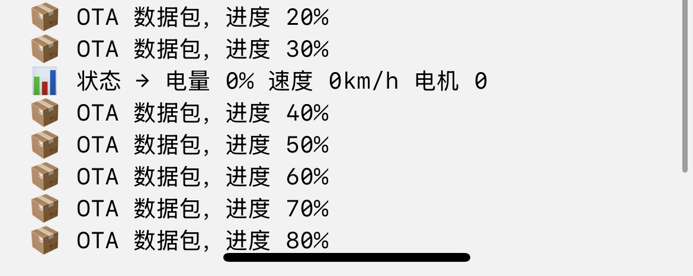
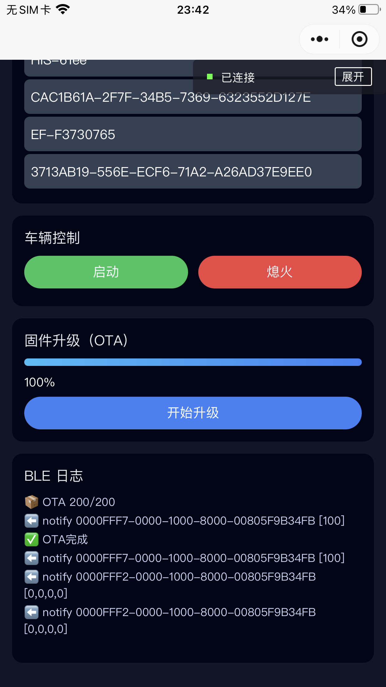

# 模拟电动车 BLE 开发 Demo 设计与实现文档

## 一、项目背景与目标

### 1. 项目背景

在 BLE 相关岗位面试准备过程中，我希望构建一个**贴近真实电动车业务场景的 BLE Demo**，用于验证和展示：

- BLE 外设与控制端之间的**真实数据交互**
- BLE 协议在 **iOS / 小程序等真实平台限制下的可行性**
- 包含 **控制指令、状态上报、OTA 升级** 的完整流程

本项目的目标不是 UI 演示，而是：

> **在真实系统、真实限制下，跑通一套完整、可信的 BLE 数据链路**

---

### 2. 项目最终实现

- 使用 **iOS 原生 App（Swift）** 模拟电动车 BLE 外设
- 使用 **微信小程序** 作为 BLE 控制端（Central）
- 完整实现：

  - BLE 广播 / 扫描 / 连接
  - 自定义服务与特征值访问
  - 控制指令下发
  - 状态数据 Notify 实时上报
  - OTA 升级数据传输与进度反馈

---

## 二、整体架构设计

### 1. 系统角色划分

| 角色       | 实现方式              | BLE 角色            |
| ---------- | --------------------- | ------------------- |
| 模拟电动车 | iOS 原生 App（Swift） | Peripheral（外设）  |
| 控制端     | 微信小程序            | Central（中心设备） |

### 2. 架构设计原则

- 外设（电动车）是 **状态的唯一来源**
- 控制端只负责：

  - 发送控制 / OTA 指令
  - 展示外设真实上报的数据

- 所有数据流必须通过 **BLE 协议真实传输**

---

## 三、模拟电动车 BLE 外设设计（Swift）

### 1. 方案探索过程

#### 1️⃣ 使用蓝牙耳机模拟（失败）

- 蓝牙耳机使用经典蓝牙或私有协议
- 无法自定义 GATT 服务
- 不适合 BLE 协议开发验证

---

#### 2️⃣ 使用 LightBlue（macOS 版）（失败）

- 可创建自定义服务和特征值
- 但目前 macOS 版本 **已经不支持 BLE 广播**

### 2. 最终方案：Swift 原生 BLE 外设

#### 选择原因

- CoreBluetooth 提供完整 Peripheral 能力
- 可精确控制广播、服务、特征值和数据发送
- 与真实硬件电动车 BLE 逻辑高度一致

---

### 3. BLE 服务与特征值设计（模拟电动车）

#### 控制与状态服务（FFF0）

| 特征值   | UUID | 属性   | 说明                   |
| -------- | ---- | ------ | ---------------------- |
| 控制指令 | FFF1 | Write  | 启动 / 熄火            |
| 状态上报 | FFF2 | Notify | 电量 / 速度 / 电机状态 |

#### OTA 服务（FFF5）

| 特征值   | UUID | 属性   | 说明             |
| -------- | ---- | ------ | ---------------- |
| OTA 数据 | FFF6 | Write  | 固件数据分包写入 |
| OTA 状态 | FFF7 | Notify | 升级进度         |

---

### 4. Swift 外设关键实现要点

- `notify` 只是能力声明，不会自动推送数据
- 必须显式调用：

```swift
peripheralManager.updateValue(_:for:onSubscribedCentrals:)
```

- 外设维护内部状态（模拟）：

  - 电量递减
  - 速度变化
  - 电机开关状态

- 每次状态变化，通过 `FFF2` 主动 notify
- 核心代码如下：

```swift
import Foundation
import CoreBluetooth

extension Notification.Name {
    static let bleLog = Notification.Name("BLE_LOG")
}

class PeripheralManager: NSObject, CBPeripheralManagerDelegate {

    private var pm: CBPeripheralManager!

    private var controlChar: CBMutableCharacteristic!
    private var statusChar: CBMutableCharacteristic!
    private var infoChar: CBMutableCharacteristic!
    private var otaDataChar: CBMutableCharacteristic!
    private var otaStatusChar: CBMutableCharacteristic!

    private var battery: UInt8 = 100
    private var speed: UInt8 = 0
    private var motorOn: UInt8 = 0
    private var otaProgress: UInt8 = 0

    private var subscribedCentrals: [CBCentral] = []

    override init() {
        super.init()
        pm = CBPeripheralManager(delegate: self, queue: nil)
    }

    // MARK: - 日志
    private func log(_ text: String) {
        print(text)
        NotificationCenter.default.post(name: .bleLog, object: text)
    }

    // MARK: - 蓝牙状态
    func peripheralManagerDidUpdateState(_ peripheral: CBPeripheralManager) {
        switch peripheral.state {
        case .poweredOn:
            log("✅ 蓝牙已开启")
            setupServices()
        case .poweredOff:
            log("❌ 蓝牙已关闭")
        default:
            log("⚠️ 蓝牙状态变化: \(peripheral.state.rawValue)")
        }
    }

    // MARK: - 初始化服务
    private func setupServices() {
        log("🚲 初始化 BLE 服务")

        // ===== 控制服务 FFF0 =====
        let controlServiceUUID = CBUUID(string: "FFF0")

        controlChar = CBMutableCharacteristic(
            type: CBUUID(string: "FFF1"),
            properties: [.write, .writeWithoutResponse],
            value: nil,
            permissions: [.writeable]
        )

        statusChar = CBMutableCharacteristic(
            type: CBUUID(string: "FFF2"),
            properties: [.notify],
            value: nil,
            permissions: []
        )

        infoChar = CBMutableCharacteristic(
            type: CBUUID(string: "FFF3"),
            properties: [.read],
            value: Data([0x01, 0x02, 0x64, 0x00]),
            permissions: [.readable]
        )

        let controlService = CBMutableService(type: controlServiceUUID, primary: true)
        controlService.characteristics = [controlChar, statusChar, infoChar]

        // ===== OTA 服务 FFF5 =====
        let otaServiceUUID = CBUUID(string: "FFF5")

        otaDataChar = CBMutableCharacteristic(
            type: CBUUID(string: "FFF6"),
            properties: [.write, .writeWithoutResponse],
            value: nil,
            permissions: [.writeable]
        )

        otaStatusChar = CBMutableCharacteristic(
            type: CBUUID(string: "FFF7"),
            properties: [.notify],
            value: nil,
            permissions: []
        )

        let otaService = CBMutableService(type: otaServiceUUID, primary: true)
        otaService.characteristics = [otaDataChar, otaStatusChar]

        pm.add(controlService)
        pm.add(otaService)

        pm.startAdvertising([
            CBAdvertisementDataLocalNameKey: "E-BIKE-DEMO",
            CBAdvertisementDataServiceUUIDsKey: [controlServiceUUID, otaServiceUUID]
        ])

        log("📡 开始广播：E-BIKE-DEMO")

        // 定时推送状态
        Timer.scheduledTimer(withTimeInterval: 1, repeats: true) { _ in
            self.pushStatus()
        }
    }

    // MARK: - 推送状态
    private func pushStatus() {
        if motorOn == 1 {
            speed = min(speed + 1, 25)
            battery = battery >= 5 ? battery - 5 : 0
        } else {
            speed = 0
        }

        let data = Data([battery, speed, motorOn, 0x00])
        pm.updateValue(data, for: statusChar, onSubscribedCentrals: subscribedCentrals)

        log("📊 状态 → 电量 \(battery)% 速度 \(speed)km/h 电机 \(motorOn)")
    }

    // MARK: - 订阅与退订
    func peripheralManager(_ peripheral: CBPeripheralManager, central: CBCentral, didSubscribeTo characteristic: CBCharacteristic) {
        if !subscribedCentrals.contains(central) {
            subscribedCentrals.append(central)
        }
        log("📲 中心设备订阅：\(characteristic.uuid.uuidString)")
    }

    func peripheralManager(_ peripheral: CBPeripheralManager, central: CBCentral, didUnsubscribeFrom characteristic: CBCharacteristic) {
        if let idx = subscribedCentrals.firstIndex(of: central) {
            subscribedCentrals.remove(at: idx)
        }
        log("📴 中心设备退订：\(characteristic.uuid.uuidString)")
    }

    // MARK: - 写入处理
    func peripheralManager(_ peripheral: CBPeripheralManager, didReceiveWrite requests: [CBATTRequest]) {
        for r in requests {
            guard let value = r.value, value.count >= 1 else { continue }

            // 控制指令
            if r.characteristic.uuid == CBUUID(string: "FFF1") {
                motorOn = value[0] == 0x01 ? 1 : 0
                if motorOn == 1 {
                    battery = battery >= 5 ? battery - 5 : 0
                }
                log("⚙️ 控制指令：\(motorOn == 1 ? "开机" : "关机")，电量 \(battery)%")
            }

            // OTA 数据包
            if r.characteristic.uuid == CBUUID(string: "FFF6") {
                simulateOTAProgress()
            }

            peripheral.respond(to: r, withResult: .success)
        }
    }

    // MARK: - OTA 进度模拟
    private func simulateOTAProgress() {
        guard otaProgress < 100 else { return }
        otaProgress = min(otaProgress + 10, 100)

        // 模拟延迟推送，更真实
        DispatchQueue.main.asyncAfter(deadline: .now() + 0.1) {
            self.pm.updateValue(Data([self.otaProgress]), for: self.otaStatusChar, onSubscribedCentrals: self.subscribedCentrals)
            self.log("📦 OTA 数据包，进度 \(self.otaProgress)%")
        }
    }

    // MARK: - OTA 重置按钮
    func resetOTAProgress() {
        otaProgress = 0
        log("🔄 OTA 进度已手动重置")
        pm.updateValue(Data([otaProgress]), for: otaStatusChar, onSubscribedCentrals: subscribedCentrals)
    }
}
```

---

## 四、控制端设计（微信小程序）

### 1. 技术选型过程

#### 初始方案：uni-app（失败）

- 受苹果企业证书政策影响，个人 ios 开发者无法再使用 dcloud 企业证书签名，[使用 Apple 证书签名 iOS 标准基座
  ](https://uniapp.dcloud.net.cn/tutorial/run/ios-apple-certificate-signature.html)
- 手头没安卓设备，不想折腾了，直接上小程序

### 2. 最终方案：微信小程序（成功）

#### 选择原因

- 可直接调用系统 BLE API
- 真机调试成本低
- 支持 BLE 扫描、连接、写入、notify

### 3. 微信小程序 BLE 的关键限制与规则

#### 1️⃣ 必须使用 **128 位 UUID**

- Swift 中的 `FFF0 / FFF1`
- 在小程序中实际表现为：

```
0000FFF0-0000-1000-8000-00805F9B34FB
```

- 所有 `serviceId / characteristicId`：

  - 必须使用系统返回的完整 UUID
  - 不能截断、不能手写、不能拼接

---

#### 2️⃣ 不能“假设连上就能通信”

- 必须显式：

  - 获取服务
  - 获取特征值
  - 订阅 notify

- 外设不发数据，Central 永远收不到

## 五、完整 BLE 交互流程（重点）

### 小程序代码：

**index.js:**

```js
const OTA_TOTAL = 200;
const PACKET_SIZE = 20;

Page({
  data: {
    devices: [],
    deviceId: '',
    deviceName: '',
    connected: false,

    // 服务 UUID（128位）
    serviceFFF0: '',
    serviceFFF5: '',

    // 特征值 UUID
    charCtrl: '',
    charStatus: '',
    charOTA: '',
    charOTAStatus: '',

    battery: 0,
    speed: 0,
    motorOn: 0,

    otaProgress: 0,
    log: '',
    scrollTop: 0
  },

  onLoad() {
    this.initBLE();
  },

  log(msg) {
    console.log(msg);
    this.setData({
      log: this.data.log + msg + '\n',
      scrollTop: 999999
    });
  },

  initBLE() {
    wx.openBluetoothAdapter({
      success: () => this.log('✅ 蓝牙初始化成功'),
      fail: (err) => this.log('❌ 蓝牙初始化失败 ' + JSON.stringify(err))
    });
  },

  scan() {
    this.setData({ devices: [] });
    wx.startBluetoothDevicesDiscovery();
    wx.onBluetoothDeviceFound((res) => {
      res.devices.forEach((d) => {
        if (!this.data.devices.find((x) => x.deviceId === d.deviceId)) {
          this.data.devices.push(d);
          this.setData({ devices: this.data.devices });
          this.log(`🔍 发现设备 ${d.name} ${d.deviceId}`);
        }
      });
    });
  },

  connectDevice(e) {
    const { id, name } = e.currentTarget.dataset;
    this.setData({ deviceId: id, deviceName: name });

    wx.createBLEConnection({
      deviceId: id,
      success: () => {
        this.setData({ connected: true, devices: [] });
        this.log('✅ 已连接');
        this.getServices();
      },
      fail: (err) => this.log('❌ 连接失败 ' + JSON.stringify(err))
    });
  },

  getServices() {
    wx.getBLEDeviceServices({
      deviceId: this.data.deviceId,
      success: (res) => {
        res.services.forEach((s) => {
          const uuid = s.uuid.toUpperCase();
          this.log(`📑 Service ${uuid}`);

          if (uuid.includes('FFF0')) this.setData({ serviceFFF0: s.uuid });
          if (uuid.includes('FFF5')) this.setData({ serviceFFF5: s.uuid });

          this.getChars(s.uuid);
        });
      }
    });
  },

  getChars(serviceId) {
    wx.getBLEDeviceCharacteristics({
      deviceId: this.data.deviceId,
      serviceId,
      success: (res) => {
        res.characteristics.forEach((c) => {
          const uuid = c.uuid.toUpperCase();
          this.log(`🔹 Char ${uuid} props=${JSON.stringify(c.properties)}`);

          if (uuid.includes('FFF1')) this.setData({ charCtrl: c.uuid });
          if (uuid.includes('FFF2')) {
            this.setData({ charStatus: c.uuid });
            this.enableNotify(serviceId, c.uuid);
          }
          if (uuid.includes('FFF6')) this.setData({ charOTA: c.uuid });
          if (uuid.includes('FFF7')) {
            this.setData({ charOTAStatus: c.uuid });
            this.enableNotify(serviceId, c.uuid);
          }
        });
      }
    });
  },

  enableNotify(serviceId, charId) {
    wx.notifyBLECharacteristicValueChange({
      deviceId: this.data.deviceId,
      serviceId,
      characteristicId: charId,
      state: true,
      success: () => this.log(`📡 notify 已开启 ${charId}`),
      fail: (err) => this.log('❌ notify失败 ' + JSON.stringify(err))
    });

    wx.onBLECharacteristicValueChange((res) => {
      const uuid = res.characteristicId.toUpperCase();
      const data = new Uint8Array(res.value);
      this.log(`⬅️ notify ${uuid} [${data.join(',')}]`);

      if (uuid === this.data.charStatus.toUpperCase()) {
        this.setData({
          battery: data[0],
          speed: data[1],
          motorOn: data[2]
        });
      }

      if (uuid === this.data.charOTAStatus.toUpperCase()) {
        this.setData({ otaProgress: data[0] });
      }
    });
  },

  sendCmd(e) {
    const cmd = parseInt(e.currentTarget.dataset.cmd, 16);
    wx.writeBLECharacteristicValue({
      deviceId: this.data.deviceId,
      serviceId: this.data.serviceFFF0,
      characteristicId: this.data.charCtrl,
      value: new Uint8Array([cmd]).buffer,
      success: () => this.log(`➡️ 控制指令 ${cmd}`),
      fail: (err) => this.log('❌ 控制失败 ' + JSON.stringify(err))
    });
  },

  startOTA() {
    this.otaOffset = 0;
    this.log('🚀 开始 OTA');
    this.sendOtaPacket();
  },

  sendOtaPacket() {
    if (this.otaOffset >= OTA_TOTAL) {
      this.log('✅ OTA完成');
      return;
    }

    const len = Math.min(PACKET_SIZE, OTA_TOTAL - this.otaOffset);
    const buffer = new Uint8Array(len).fill(0xaa).buffer;

    wx.writeBLECharacteristicValue({
      deviceId: this.data.deviceId,
      serviceId: this.data.serviceFFF5,
      characteristicId: this.data.charOTA,
      value: buffer,
      success: () => {
        this.otaOffset += len;
        this.log(`📦 OTA ${this.otaOffset}/${OTA_TOTAL}`);
        setTimeout(() => this.sendOtaPacket(), 100);
      }
    });
  }
});
```

**index.wxml:**

```html
<view class="page">
  <!-- 设备状态 -->
  <view class="device-card">
    <view class="device-header">
      <text class="device-name">{{deviceName || '未连接设备'}}</text>
      <text class="device-status {{connected ? 'on' : 'off'}}">
        {{connected ? '● 已连接' : '● 未连接'}}
      </text>
    </view>

    <view class="dashboard">
      <view class="battery">
        <text class="battery-value">{{battery}}%</text>
        <text class="battery-label">电量</text>
      </view>

      <view class="speed">
        <text class="speed-value">{{speed}}</text>
        <text class="speed-unit">km/h</text>
      </view>
    </view>
  </view>

  <!-- BLE 操作 -->
  <view class="card">
    <view class="title">蓝牙操作</view>
    <view class="control-row">
      <button class="btn gray" bindtap="scan">扫描设备</button>
    </view>

    <view wx:if="{{devices.length}}">
      <view
        wx:for="{{devices}}"
        wx:key="deviceId"
        class="device-item"
        bindtap="connectDevice"
        data-id="{{item.deviceId}}"
        data-name="{{item.name}}"
      >
        <text>{{item.name || item.deviceId}}</text>
      </view>
    </view>
  </view>

  <!-- 控制按钮 -->
  <view class="card" wx:if="{{connected}}">
    <view class="title">车辆控制</view>
    <view class="control-row">
      <button class="btn on" bindtap="sendCmd" data-cmd="01">启动</button>
      <button class="btn off" bindtap="sendCmd" data-cmd="00">熄火</button>
    </view>
  </view>

  <!-- OTA -->
  <view class="card" wx:if="{{connected}}">
    <view class="title">固件升级（OTA）</view>
    <view class="ota-progress">
      <view class="ota-bar" style="width: {{otaProgress}}%"></view>
    </view>
    <view class="ota-text">{{otaProgress}}%</view>
    <button class="btn ota" bindtap="startOTA">开始升级</button>
  </view>

  <!-- 日志 -->
  <view class="card log-card">
    <view class="title">BLE 日志</view>
    <scroll-view scroll-y class="log-box" scroll-top="{{scrollTop}}">
      <text>{{log}}</text>
    </scroll-view>
  </view>
</view>
```

**index.wxss:**

```css
.page {
  padding: 24rpx;
  background: #0f172a;
  color: #fff;
}
.device-card {
  background: linear-gradient(135deg, #1e293b, #020617);
  border-radius: 24rpx;
  padding: 32rpx;
  margin-bottom: 24rpx;
}
.device-header {
  display: flex;
  justify-content: space-between;
  margin-bottom: 32rpx;
}
.device-name {
  font-size: 32rpx;
  font-weight: bold;
}
.device-status.on {
  color: #22c55e;
}
.device-status.off {
  color: #64748b;
}
.dashboard {
  display: flex;
  justify-content: space-between;
  align-items: center;
}
.battery {
  width: 160rpx;
  height: 160rpx;
  border-radius: 50%;
  border: 8rpx solid #22c55e;
  display: flex;
  flex-direction: column;
  justify-content: center;
  align-items: center;
}
.battery-value {
  font-size: 36rpx;
  font-weight: bold;
}
.battery-label {
  font-size: 22rpx;
  color: #94a3b8;
}
.speed {
  text-align: right;
}
.speed-value {
  font-size: 96rpx;
  font-weight: bold;
}
.speed-unit {
  font-size: 26rpx;
  color: #94a3b8;
}
.card {
  background: #020617;
  border-radius: 20rpx;
  padding: 24rpx;
  margin-bottom: 24rpx;
}
.title {
  font-size: 28rpx;
  margin-bottom: 16rpx;
  color: #e5e7eb;
}
.control-row {
  display: flex;
  gap: 20rpx;
  margin-bottom: 12rpx;
}
.btn {
  flex: 1;
  border-radius: 999rpx;
  color: #fff;
  font-size: 26rpx;
}
.btn.gray {
  background: #334155;
}
.btn.on {
  background: #22c55e;
}
.btn.off {
  background: #ef4444;
}
.btn.ota {
  background: #3b82f6;
}
.ota-progress {
  height: 16rpx;
  background: #1e293b;
  border-radius: 8rpx;
  overflow: hidden;
  margin: 16rpx 0;
}
.ota-bar {
  height: 100%;
  background: linear-gradient(to right, #38bdf8, #3b82f6);
}
.ota-text {
  font-size: 24rpx;
  margin-bottom: 12rpx;
}
.log-card {
  height: 360rpx;
}
.log-box {
  height: 280rpx;
  font-size: 22rpx;
  color: #cbd5f5;
  white-space: pre-line;
}
.device-item {
  padding: 14rpx;
  margin-bottom: 6rpx;
  background: #334155;
  border-radius: 12rpx;
}
.device-item text {
  font-size: 26rpx;
  color: #fff;
}
```

### 1️⃣ 初始化

- 小程序调用 `wx.openBluetoothAdapter`
- 系统蓝牙能力准备完成

### 2️⃣ 扫描与连接

- 小程序扫描周围 BLE 设备
- 用户选择模拟电动车设备
- 建立 BLE 连接
  

### 3️⃣ 服务与特征值发现

- 小程序获取外设所有服务
- 识别：

  - 控制服务（FFF0）
  - OTA 服务（FFF5）

- 获取对应特征值 UUID
  

### 4️⃣ 订阅状态通知（关键）

- 对 `FFF2（状态）` 和 `FFF7（OTA 状态）`：

  - 调用 `notifyBLECharacteristicValueChange`

- 至此，数据通道建立完成

### 5️⃣ 控制指令交互（真实闭环）

#### 流程

1. 小程序写入 `FFF1`

   - `0x01`：启动，启动后电量和速度将会变化
   - `0x00`：熄火



2. Swift 外设 `didReceiveWrite` 收到指令
3. 外设改变内部状态
4. 外设通过 `FFF2` 主动 notify
5. 小程序收到数据并更新 UI
   
   👉 **这是完整的 BLE 控制-反馈闭环**

### 6️⃣ 状态数据展示

- 状态数据格式：

| Byte | 含义        |
| ---- | ----------- |
| 0    | 电量 (%)    |
| 1    | 速度 (km/h) |
| 2    | 电机状态    |

- 小程序解析 notify 数据并实时展示

### 7️⃣ OTA 升级流程（完整跑通）

1. 小程序分包写入 `FFF6`
2. Swift 外设接收 OTA 数据
3. 外设通过 `FFF7` notify 当前进度
4. 小程序实时显示 OTA 进度
   
   👉 覆盖了真实设备 OTA 的基本通信模型

---

## 六、总结

✅ 成功使用 **Swift 原生 App 模拟电动车 BLE 外设**

✅ 成功使用 **微信小程序作为 BLE 控制端**

✅ 自定义服务与特征值 **真实访问成功**

✅ 控制指令、状态上报、OTA 升级 **全部跑通**

### BLE 的本质是“协议 + 状态机”

- 数据一定来自外设
- Central 永远是被动接收
- 框架无法绕过协议本身的限制

**该 Demo 在真实平台限制下，完整实现了 BLE 数据交互与 OTA 升级流程**
