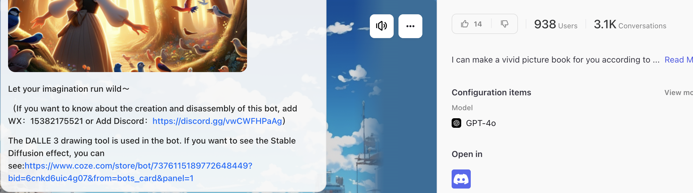

## AI 实战｜副业，不卖关子，也不拆解原理了，直接告诉你怎么做的

昨天整理了很多整合网站，今天讲点细致的场景应用，不卖关子，也不搞原理拆解，简单粗暴告诉你用什么无脑制作，觉得有用点个在看和关注

生成式 AI 目前做的比较好的就是图文了，找对路子，既使用简单，又制作轻松。

## 1、爆款治愈图文

- 无非就是一句话一张图，合成！
- 这个小程序《有图有梗》直接用

## 2、故事类图文视频

国际版 coze 里有工作流`Dream Stroybook`，主要是用`GPT-4o`和`DALLE 3`

- 一图胜千言，有视频不图文
- 直接看视频吧，我做了个示例：
- 但是我三脚猫剪辑水平，勉强出个片
