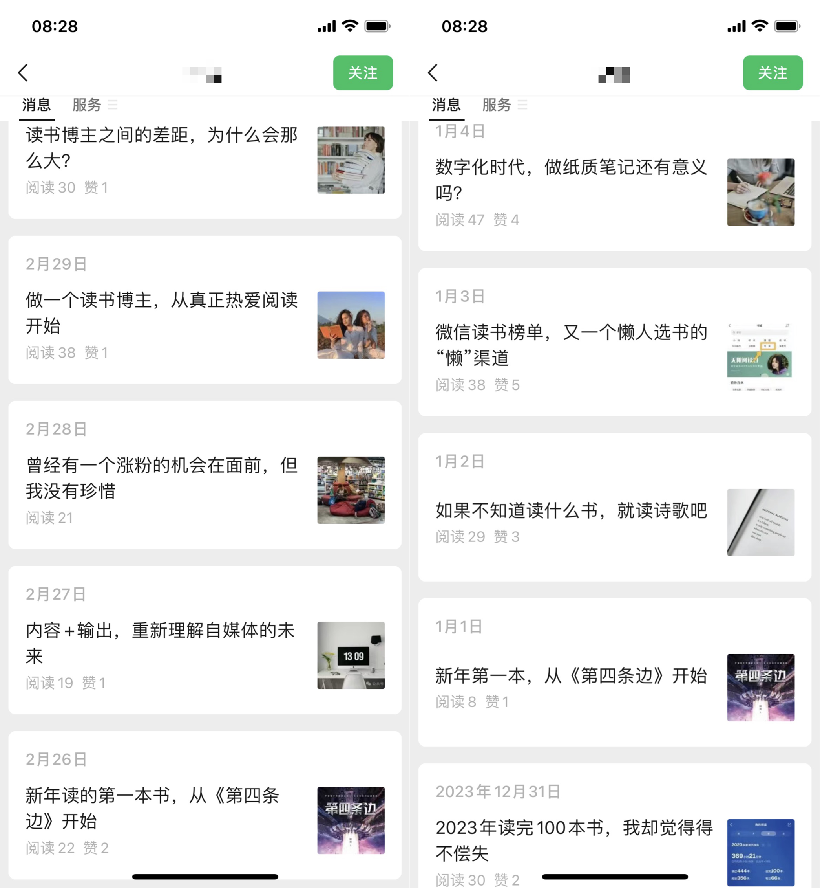
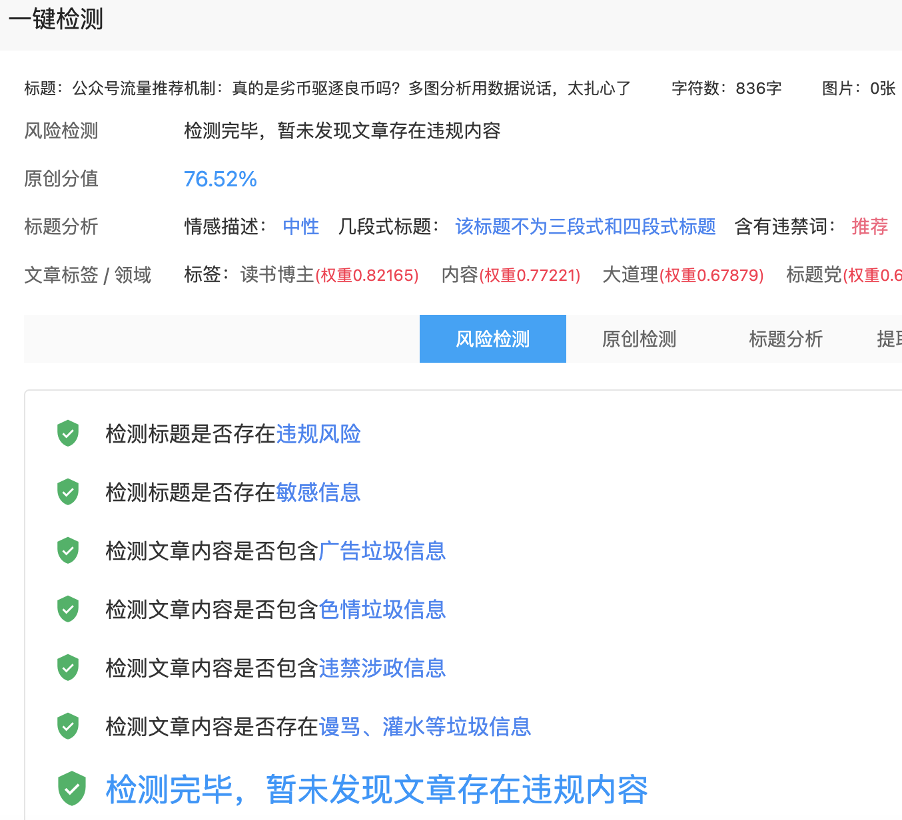

# 公众号流量机制，真的是劣币驱逐良币吗？多图分析用数据告诉你答案

答案是`是也不是`
“谎言跑遍天下，真相还没穿上鞋。”马克·吐温的这句名言在如今的自媒体时代显得格外真实。
“在信息的海洋中，如何让你的声音被听见？”下面多图分析用数据告诉你答案和应对方法

## 我说是

不管哪个平台的算法推荐都是更倾向于娱乐性强、冲突对立、标题党、煽动性强的轻内容。

大道理就不讲了吧，我们找几个博主研究一下。

## 这是一位读书博主

- 一开始肯定是满怀信心
  
- 现实就是分享读书心得，压根没人看

- 然后讲讲流量和收入，阅读量明显上来了，有好几篇大几千

## 这是另外一位读书博主

- 她说她 13000 粉丝，广告接单 1000/单，档期排满，我们来看看她的记录

- 正常写大道理的也是没人看，都是 1000 左右的阅读，爆款依然是谈月入 5 位数的文章

## 再看看热点八卦娱乐类有多猛

## 我说不是

`内容优秀依然是王道`，运营手段可以有，内容万万不可没有

## 太恐怖了，宝妈都在卷公众号

- 我不排斥立人设，但讨厌骗子

## 我们选一个说收入很高的看看

- 光看标题，我是不知道真假，但数据是不好看，我也拜读了几篇，文采不好也没有什么利他性，反反复复就说自己收入高，自由，不上班等等，只能说还好她没火

## 质疑大数据，理解大数据，拥抱大数据

所以内容依然是基础，但是你首先要研究一下运营手法，和别人站到同一起跑线上去公平竞争；

如果不想换赛道，那就在做好内容的情况下，多思考标题。即使你写的是健身干货，你也不要用专业术语来写标题，不如写《喝水减肥，一天瘦 3 斤》，只要内容优秀，我就不会觉得被骗。

- 怎么写标题的文章也很多了，就不说了
- 同时也是因为写文章的人太多了，你觉得你是原创，其实不一定，我找了个工具查了下以往的文章，果然是有问题的，多方面的，不仅是原创问题，有时候写到兴起，来句国粹烘托下气氛也会导致文章分数下降

## 用魔法打败魔法

- 工具网址：https://www.yizhuan5.com/

## 结尾

虽然确实存在劣币驱逐良币的现象，但只要我们重视标题、筛选选题，并学会利用大数据，就能让优质内容脱颖而出。希望这篇文章能给你一些启发，内容质量和运营手段并重，才是获取流量的关键。继续努力，相信你也能成为下一个爆款作者！
