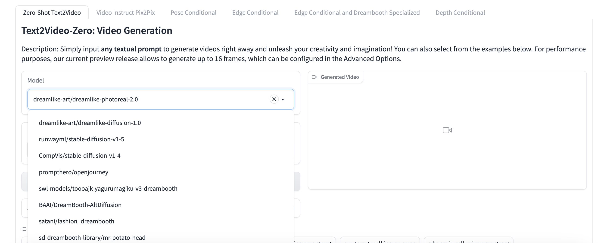

# <Label :level='1'/> 我和两名 AI 员工的故事，一个小需求差点散伙

> 今天野路子创业公司正式成立了，团队成员目前 3 个人，我和两名 AI 员工

## 前言

我作为大老板，白手起家，一人创建了野路子公众号、小程序、视频号等等，知乎、B 站、头条等等也在未来战略规划里。
我打算用故事的模式记录`野路子公司在AI方向的成长趣事`，希望各位精神股东能喜欢。

## 团队成员介绍

- 小 G：偷渡来的美籍阿三，全名 chatGPT3.5，偶尔可以爆发一下小宇宙，用一点 GPT4o 的能力。
- 小 K：数百名竞岗人员中脱颖而出的本土选手，全名 Kimi，隶属月之暗面劳务公司。
- 野路子：没错，就是我，正在从技术转型为画饼大师，一切都是为了给员工们提供实现自我价值的平台。

## 开发个小需求

- 打算在小程序做一个资讯页面，快速了解最新信息
- 先搞一个日漫试试手，页面是这样的：
  <!--  -->

1. 每日执行爬虫脚本，获得最新数据；
2. 开发后端接口为页面提供数据；
3. 编写小程序页面渲染数据；

## 敏捷开发，派活

前两天我已经安排小 G 完成了爬虫脚本的开发，[AI 实战｜和 chatgpt 聊聊天就把网络爬虫做好了](../../ai/content/aiReptiles.md)，表现不错，被评为上周优秀员工，奖励星巴克咖啡一杯～

于是小 K 也很想表现自己，这次小 K 毛遂自荐，来开发小程序页面：

<!--  -->

我和他客气了一句，他立马骑脸输出，小伙子还是太急躁了，反应是快的，但是我需求还没说呢，他已经写完了第一版废案。

<!--  -->

耐心！耐心！我开始耐心的讲述我的需求，小 K 也很快编写完了代码，就不贴出来了，分 html、css、js 一整套都写完了。

容我验收一下，果然小伙子还是太年轻了，写的页面有点丑，细节不够，还偷工减料，于是我又指点了一番：

<!--  -->

<!--  -->

在我两次提点下，小 K 算是完成了任务，然后我亲自出马修改了一点，定了稿，介于他表现还不错，再让他开发一下接口吧

<!--  -->

小 K 给的是 express 框架发开的，我想用 koa2，于是让他改

<!--  -->

<!--  -->

小 K 改了好几次，接口一直返回 404，因为读取文件是异步操作，所以接口返回不会等待文件读取完成，我本来还打算继续指点他，但是...

<!--  -->

哦豁，我还没嫌弃他，他先撂挑子了。打入冷宫，有请远程办公的小 G：

<!--  -->

我直接把小 K 写的接口代码，发给小 G 看了看，我都没有开口，他就发现问题并修复了，小 G 还是厉害啊。
上周的星巴克咖啡没白请，于是我又让他给我蹭了一波热点，写了一篇【】
哦豁还没写完，他就显示 4o 能力耗尽，让我给他涨薪。

## 散伙，散伙

涨薪是不可能的，我让他们先下班了，然后我自己完成了这个小程序和蹭热点文章的最后的收尾。
散伙是不可能的，他们可是我`没花钱`招聘来的，而且从众多面试者中千挑万选出来的，工作时间短点，只能忍了。
