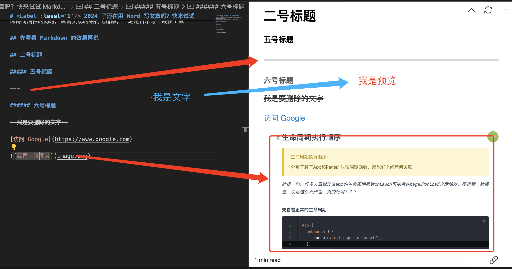
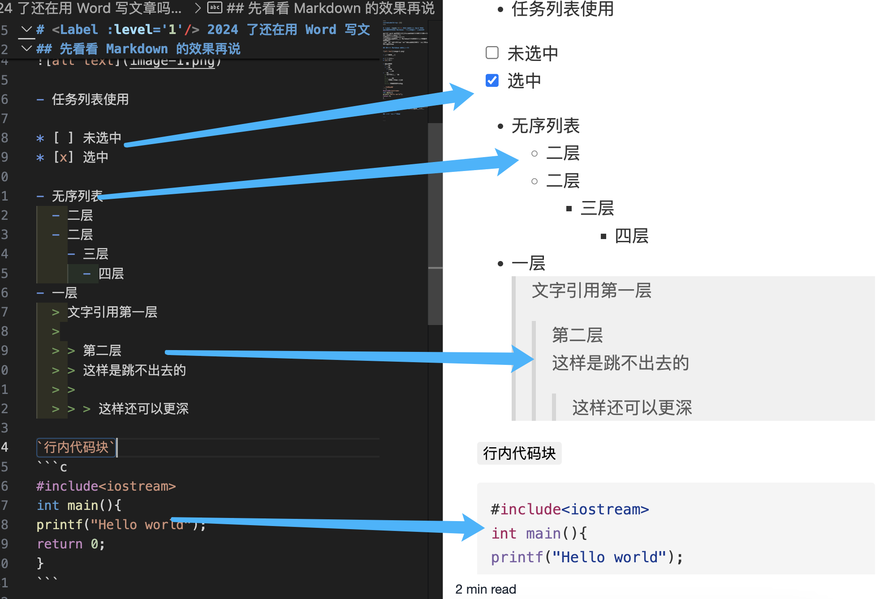
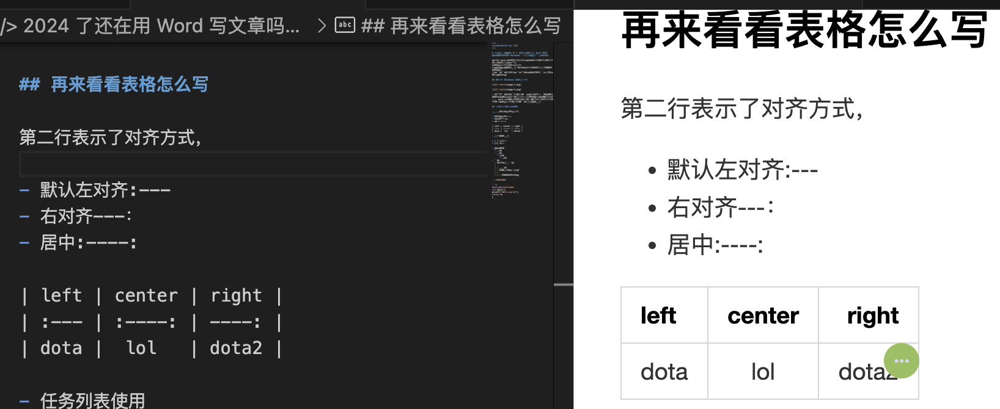
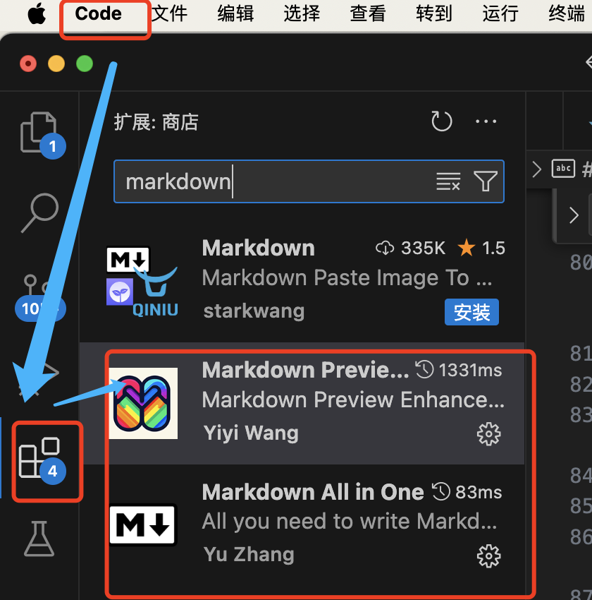
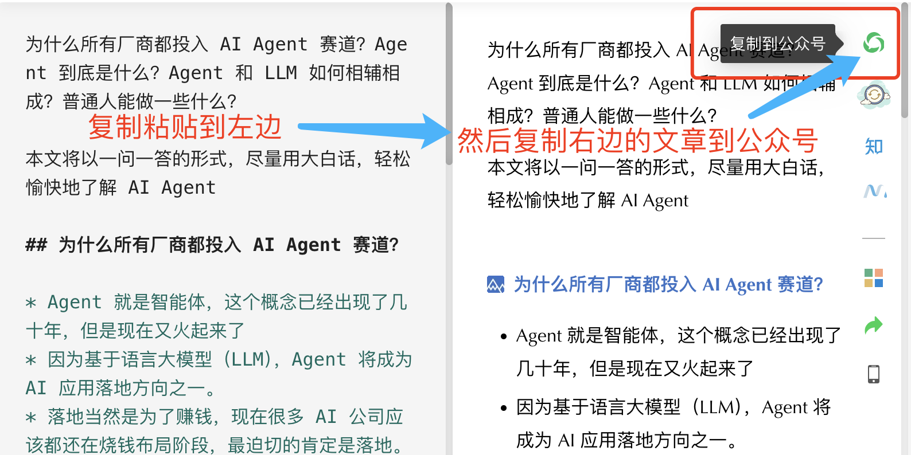

# <Label :level='1'/> 2024 了还在用 Word 写文章吗？快来试试 Markdown 吧，保证你用过停不下来

不能说 word 不强大，只能说它不合适，工欲善其事，必先利其器；

本篇文章教你如何使用 Markdown，以纯文本格式快速编写文章， 保持简洁性的同时，具备美观的结构化排版

如果你想快速用 Markdown 编写美观的公众号文章，请看到最后

## 先看看 Markdown 的效果再说





- 大概有所了解了吧，就是很简单的在文字前加点符号，就可以获得相当美观的格式，基本写文章用到的功能都有
- 而 word 虽然功能强大，但是很多功能其中没有用，文字写多了还特卡，就是有种杀鸡用牛刀的感觉

## 再来看看表格怎么写



- 怎么样是不是很简单，又美观，那么接下来稍微讲一点官方的解释，后面还会介绍怎么写和一些辅助软件

## Markdown 是什么？

Markdown 是一种轻量级的标记语言，它允许你使用易读易写的纯文本格式编写文档，然后转换成结构化的 HTML（或者其他格式）页面。简单来说，它就是让你的文本看起来更漂亮，同时又保持了文本的简洁性。

## Word 与 Markdown 的较量

### Word 文档的核心优缺点：

- 格式化能力强大
- 图形和表格处理：能处理复杂的图形和表格
- 广泛的兼容性：毕竟是行业标准
- 模板丰富
- **但是，**文件体积较大
- 版本控制困难：不易于版本控制，尤其是当多人协作时
- 平台依赖性：不同操作系统上可能会有所差异

### Markdown 文档的核心优缺点：

- 轻量级：纯文本形式，文件体积小，便于传输和存储。
- 易于阅读和编写：语法简单直观
- 版本控制友好：文本性质使其非常适合使用版本控制系统，如 Git。
- 跨平台兼容性：Markdown 文件可以在任何文本编辑器中打开，不受平台限制。
- **但是，**格式化能力有限

* 需要转换：为了获得丰富的展示效果，Markdown 文档通常需要转换成 HTML 或其他格式。

**看完这些，你应该清楚在什么时候你该打开什么软件了**

## 创建和编辑 Markdown 文件

- 直接新建文件，保存时后缀.md 即可，例：`markdown.md`
- 然后就按照我上面展示的那样编写文字

### 介绍一些一些基本的 Markdown 语法

一开始不太会可以直接复制下面的，别忘了语法符号后面都要加**一个空格**

- 标题：在文字前面加#，比如`# 这是一级标题`
- 粗体和斜体：`用两个*或_包围文字`，比如`**加粗**或*斜体*`
- 链接：`[链接文字](URL)，比如[访问Google](https://www.google.com)`
- 列表：`在文字前加-或*，比如- 列表项一`
- 图片：`和链接类似，用!开头，比如`
- 表格：

```markdown
| left | center | right |
| :--- | :----: | ----: |
| dota |  lol   | dota2 |
```

- 引用：`> 我是引用`

* 这边也贴一下[官方文档](https://markdown.p2hp.com/basic-syntax/)(https://markdown.p2hp.com/basic-syntax/)，可以去查阅语法

## 试试这些 Markdown 编辑器

虽然可以向文本一样直接写，但如果有一个好用的编辑器，那肯定更舒服

### 首先推荐 Visual Studio Code

- 功能强大，通过安装 Markdown 插件，可以获得很棒的编辑体验，我平时写代码也用这个
- Markdown All in One 插件：旨在提高使用 Markdown 进行写作的效率，主要有以下功能：

1. 快捷键支持
2. 表格格式化
3. 自动预览
4. 列表自动编号
5. 智能跳转
6. 等等...

- Markdown Preview Enhanced 插件：适合需要高级 Markdown 处理功能的用户
- 就是我装的这两个，如下图，emmmm 如果不会用，自行搜索一下，本篇就不展开了，或者用后面 2 个
  

### Typora

界面简洁，所见即所得，非常适合新手，自己安装就行，虽然它现在收费了，但还是有免费版可以用用

### Bear

如果你用 Mac，Bear 不仅美观，而且功能丰富。

## 公众号还是富文本编辑器怎么办

用石墨助手可以将 md 文件转公众号文章，而且更漂亮


- 地址在这https://www.mdnice.com/ai-chat
- 当然你也可以直接在石墨网站上写 md 文章
- 但我习惯在本地写了，因为我有自己的一套项目
- 后面看看 AI 方面的内容可能会升级一下本地笔记系统

这是一个前端野路子，疯狂生长的路上需要沉淀，分享是我沉淀成长的方式，而您的关注反馈是我所需的养分，希望互励共勉一起成长！
