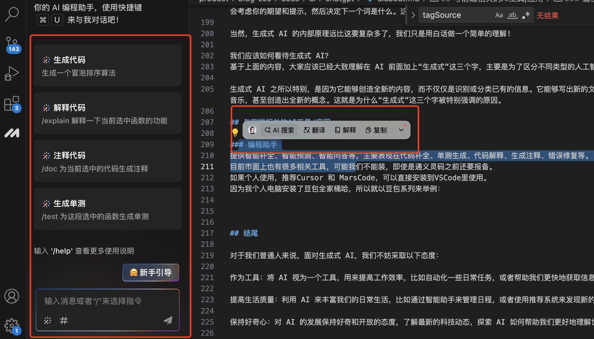
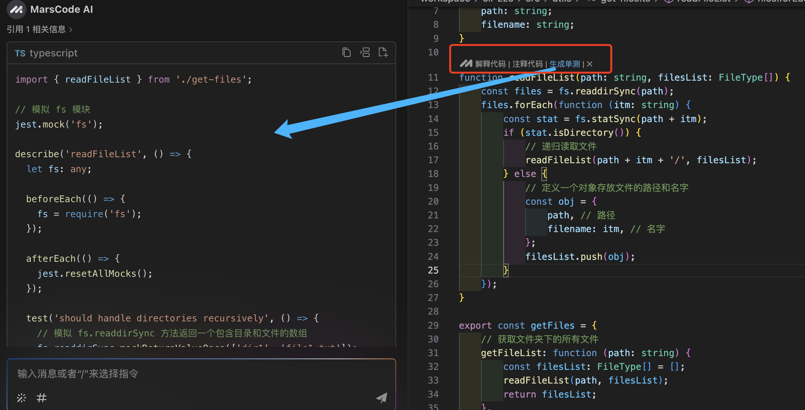

随着人工智能技术的飞速发展，各个领域都迎来了前所未有的新机遇或变革。
本篇主要关注落地方向的 AI 应用，以此来：

- 提高效率，合理使用 AI 辅助工具；
- 补齐短板，即使你擅长的领域，也可以通过 AI 的帮助做到 60%～ 80%；
- 提高创作力，借助生成式 AI 获取灵感。

### AI 领域其实非常广泛，以下是几种常见的类型：

1. 判别式 AI：这种 AI 主要用于分类和识别任务，比如图像识别、语音识别等。它们通过学习数据的特征来区分不同的类别。分类识别之后，就是分析情况并做出决策，评估多种选项和可能的结果。例如，在自动驾驶车辆中，就是通过决策式 AI 系统决定何时加速、减速或变换车道。

2. 专家系统：模仿专家的决策过程，通常用于特定领域的问题解决，如医疗诊断、法律咨询等。

3. 强化学习 AI：通过与环境的交互来学习如何做出决策，以获得最大的累积奖励。这种 AI 在游戏、机器人控制等领域有广泛应用。

4. 符号推理 AI：依赖于符号和规则进行逻辑推理，解决数学问题或逻辑谜题。

5. 感知机和神经网络：早期的 AI 技术，通过模拟人脑神经元的方式来处理信息。

6. 生成式 AI：专注于创造全新内容。它可以根据学习到的数据自动生成文本、图像、音乐等内容。例如，你可以将几篇论文发给生成式 AI，他可以生成一篇文献综述，囊括了这几篇论文的关键思想、重要结论。

AI 大模型的出现，为前端带来了多方面的变革。在代码生成与自动化方面，如 GPT-4 等 AI 工具能够自动生成高质量的前端代码，从简单的组件到复杂的应用程序，大大提高了开发效率，降低了人为错误的可能性。跨平台开发支持也更加便捷，AI 可以帮助生成适用于不同平台的代码，简化开发过程，增加开发的灵活性和效率。

作为普通人，我们大多数是使用`判别式AI`和`生成式AI`来辅助提高效率。

## 什么是生成式 AI

专业定义：生成式人工智能(Generative AI)是一种利用机器学习模型来生成新数据实例的人工智能技术。这些数据实例在统计特性上与训练数据相似，但具有不同的具体内容或结构。生成式 AI 通常依赖于复杂的算法，如生成对抗网络(GANs)、变分自编码器(VAEs)、循环神经网络(RNNs)等，它们能够捕捉到数据的分布特征，并在此基础上创造出新的样本。

白话定义：生成式 AI 能够根据已有的数据模式生成新的数据实例，简单来说，它先学习大量数据，再模仿，后创造，就像孩子先模仿大人的行为习惯，产生自己的行为模式。这种技术通常用于创造文本、图像、音频和视频等内容。

生成式 AI 简单作个分类，如下：

1. 生成文字：主要是用大语言模型，如 ChatGPT、Kimi、通义千问等等。
2. 生成图片：主要有开源王者 Stable-Diffusion、闭源 Midjourney，还有一大堆基于这 2 者的套壳。
3. 生成视频：国内代表可灵、即梦，国外 Runway、Pika 等。
4. 生成音乐：Suno、天工等。
5. 生成小说：MidReal 以及大部分大语言模型都可以定向训练。
6. 生成漫画：巨日禄、白日梦等。

层出不穷的 AI 工具可谓乱花渐欲迷人眼，以上举例只是冰山一角，各种 AI 工具通过组合还能玩出更多花样。

## 生成式 AI 的原理

学习知识+生成新知识。

我们来把这个过程用下面捏泥人的过程类比一下：

### 第一步：捏泥人-搭建硬件架构

要打造一个生成式 AI 的“泥人”，首先要考虑的就是泥从哪里来?在 AI 的世界就是底层硬件，由 AI 的算力和存储力构成。

1. 算力—骨架

生成式人工智能在处理复杂数据如图像和视频时，需要进行密集的计算。这需要依赖以下核心硬件支持：

- GPU(图形处理器)：拥有大量小处理单元，能够同时处理多个任务，极大提升了计算速度。

- TPU(张量处理器)：这是为 AI 训练特别优化的硬件，可以显著提高计算效率，加强了整体性能。

2. 存储力—血液

AI 是不需要休息的，就像是个超级图书馆，只要场地够大，有多少知识就可以学多少，并记住。

为了让这个写作机器运转得更顺畅，我们需要给它配备一些强大的硬件：

- 大容量 RAM：这就像是它的超级大脑，能够快速存取大量的计算结果和知识点，让数据处理变得飞快。

- SSD(固态硬盘)：大容量的 SSD 具有高速读取和写入能力，这就像是泥人的高速书架，能够迅速读取和存储信息，让知识的存取变得既快速又高效。

基本的泥人形态有了，但是目前它还没有任何能力，我们就要给他装上大脑。

### 第二步：装大脑——构建软件架构

软件架构就像是 AI 的大脑，决定了它如何理解和处理数据。

想象一下，我们希望 AI 能像人脑一样思考和学习——这就是深度学习的概念。

为了实现深度学习，研究者们设计了各种神经网络架构：

- 深度神经网络(DNN)是最常用的一种架构，但面对越来越复杂的数据，它开始显得有些力不从心。

- 卷积神经网络(CNN)是专门为图像设计的，它能很好地处理图像，但需要对输入的图片进行一些复杂的处理。

- 当我们处理的是一系列数据，比如时间序列或文本时，循环神经网络(RNN)就派上用场了。

但 RNN 在处理很长的数据序列时可能会遇到一些问题，比如梯度消失，这会导致模型效果变差。为了解决这个问题，研究者们提出了 Transformer 算法。

随着计算能力的提升，生成式 AI 的网络结构越来越先进，各有所长：

- Transformer 架构：目前文本生成领域的主流架，在写文章、聊天等领域已经被广泛使用。像 GPT、llama2 这样的大语言模型就是用 Transformer 架构，表现出色。

- GANs 架构：在制作图片和视频方面很有一套，能够创造出既清晰又逼真的视觉效果。

- Diffusion 架构：在绘画和音乐创作上表现不俗，能够创作出既优质又多样的作品。

网络架构搭建好了，脑子是有了，脑子也具备很强的基础能力，但是没有数据输入，也还是一个空壳。所以我们需要通过数据训练给这个人造大脑喂知识。

### 第三步：教知识-数据训练

现在训练 AI 主要有两种方法：预训练和 SFT(有监督的微调)。

- 预训练：就是先给 AI 一大堆各种各样的信息，让它有个基础的了解。

经过预训练的 AI，就像一个通才，对很多领域都略知一二，但还算不上专家。

- SFT：在预训练的基础上，再给 AI 一些特定任务的信息，让它更深入地学习。

比如，如果想让 AI 更懂医学，就可以用医学文献来进一步训练它，让它在回答医学问题或写医学相关的内容时更专业。

**不过，无论是预训练还是 SFT，AI 是怎么消化这些知识的呢?**

1. AI 的"理解"能力，咱们就拿 Transformer 架构来聊聊，它是怎么理解文字的。

- AI 理解文字分两步走：先理解单个词，再理解整个句子。

- 理解词，其实就是把词分类。研究者们想出了个办法：把词拆成不同的部分，然后分类。

举个例子，有四个词：西瓜、草莓、番茄和樱桃。AI 用两个标准来拆解这些词：

颜色：红色用 1 表示，绿色用 2 表示

形状：圆形用 1 表示，椭圆形用 2 表示

然后，AI 就根据这些标准给这些词打分，分类。

西瓜：颜色是 2(绿色)，形状是 1(圆形)。

草莓：颜色是 1(红色)，形状是 2(椭圆形)。

番茄：颜色是 1(红色)，形状是 1(圆形)。

樱桃：颜色是 1(红色)，形状是 1(圆形)。

这样，AI 就能通过这种方式来"理解"每个词的特点了。

比如说，"番茄"和"樱桃"在颜色和形状上都是红的、圆的，这就意味着在这两个方面，它们给人的感觉是一样的。而"草莓"和"西瓜"在颜色和形状上就不一样，一个红的、椭圆的，一个绿的、圆的，所以在这两个方面，它们给人的感觉就不同。

但是，要区分它们，我们可不仅仅看颜色和形状这两个方面。AI 还可以从很多其他方面来评价，比如大小、甜度、有没有籽等等，这样就能更细致地分类。

只要我们评价的方面足够多，给的分数足够准确，AI 就能更精准地理解每个词到底是什么意思。

对于现在那些特别先进的 AI 模型，它们能够考虑的维度数量非常庞大，有时候能达到上千个。

学会识别和理解单个词语，把它们转换成量化的结果，这只是第一步。接下来，AI 要更进一步，理解由多个词组成的集合：句子。

我们明白，即使是同一个词，在不同的语境下，意思也会不一样。比如：

“这是一顶绿色的帽子。” 这句话里，“绿色”的帽子，就是指帽子的颜色是绿色的。

某某公司致力于打造绿色机房。

2. AI 怎么分辨同一个词在不同句子里不同的意思呢?这就要归功于 Transformer 架构里的“自注意力”机制了。

AI 在理解一个句子的时候，它不只是看每个词自己，还会看看它旁边的词。这个词和句子里其他词的关系，就是“注意力”。因为它是和句子里自己的词一起理解的，所以叫“自注意力”。

在 Transformer 架构里，这个过程分成两步：

- 把每个词变成一个向量。这个向量就像是在很多维度上给这个词定位，显示了这个词的各种特点。

- 用自注意力机制来关注句子的不同部分。这样，在处理每个词的时候，AI 还会考虑句子里其他词的信息，从而理解这个词在这个特定句子里的意思。

### 第四步：开始做事—内容生成

AI 在理解了大量的词和句子之后，就像个经验丰富的作家，开始创作新内容了。它是怎么做的呢?其实，这背后是一个关于概率的问题。

举个例子，大家来填空：

我在餐厅吃 ×。

× 这个位置，你会填什么字?

根据我们通常的经验，很可能第一个想到的是“饭”。但 × 其实也可以填“饼”、“面”、“蛋”等等。

AI 生成内容的过程也是这样。它会根据它学到的大量语言模式和概率，来决定在某个地方用什么词最合适。就像我们填空一样，AI 会根据上下文，选择一个最有可能的词来填进去。这样，一个词接一个词，AI 就能写出一段段新的内容了。

就像我们人一样，生成式 AI 也会根据它之前学到的东西，给每个字或词一个概率。然后，它会挑那些概率高的词来组成句子。AI 会一遍又一遍地这么做，每次都选下一个最可能的词，这样就能连续不断地生成新内容。

但有时候，我们想要的不仅仅是最普通的答案，就像之前那个例子，如果不想 AI 总是接“饭”，那该怎么办呢?

这时候，AI 有个调节参数，它的范围是从 0 到 1。

- **0**：AI 会挑概率最高的词，比如在这个例子里，很可能就是“饭”。

- **1**：AI 会挑概率不那么高的词，这样可能会选“饼”。

如果温度值接近 1，AI 生成的内容就会更加多样和有创意。

比如，如果我们把温度设为 0.8，AI 生成的句子可能就会是：

我在餐厅吃饼，这个饼又大又圆，我想把它套在脖子上…这样的句子听起来就更有想象力和趣味性了。

如果你的提示词是：“你是一名某某领域的专家，请用严谨的口吻写一篇关于 xx 的文献综述。”这时，就像是把 AI 的温度调低了，它会选择那些最常见、最匹配的词来生成内容，就像专家那样说话。

如果你的提示词是：“请你畅想一下 xx 的未来。”这时，就像是把 AI 的温度调高了，它会选择一些不那么常见、更有创意的词来生成内容，可能会带来一些意想不到的惊喜。

现在你知道了，一个好的提示词对于引导 AI 生成你想要的内容有多重要。

所以，我们可以把 AI 生成内容的过程想象成一场词语接龙游戏：AI 根据当前的词，回想它之前学到的下一个最可能的词，同时还会考虑你的期望和提示，然后决定下一个词是什么。这样一来，AI 就能写出一段又一段符合你期望的文字了。

当然，生成式 AI 的内部原理远比这要复杂多了，我们只是用白话做一个简单的理解!

我们应该如何看待生成式 AI？
基于上面的内容，大家应该已经大致理解在 AI 前面加上“生成式”这三个字，主要是为了区分不同类型的人工智能。

生成式 AI 之所以特别，是因为它能够创造全新的内容，而不仅仅是识别或分类已有的信息。它能够写出新的文章、生成新的图像或音乐，甚至创造出全新的概念。这就是为什么“生成式”这三个字被特别强调的原因。

## 与前端相关的 AI 工具/应用

### 编程助手

提供智能补全、智能预测、智能问答等，主要表现在代码补全、单测生成、代码解释、生成注释、错误修复等。
目前市面上也有很多相关工具，可能我们不能装，即使是通义灵码之前还要报备。
如果个人使用，推荐 Cursor 和 MarsCode，可以直接安装到 VSCode 里使用。
因为我个人电脑安装了豆包全家桶哈，所以就以豆包系列来举例：

安装完成后，就会自动补全代码，可以使用指令，函数上方会出现快捷指令：

这样大幅提高写单测的时间，也可以快速补上注释，接手新项目时可以先让 AI 分析解释代码。

### AI 搜索

搜索应该和我们息息相关，AI 搜索相比传统搜索有一下特点：

1. 🚫 无广告干扰：目前无广告，直达。
2. 📚 减轻信息过载：在传统搜索引擎中，我们常常需要在海量的信息中筛选，这不仅耗时耗力，还可能导致我们错过最重要的信息。AI 搜索会先帮我们筛选梳理一遍。
3. 搜索技巧要求：传统搜索引擎依赖于用户输入的关键词，如果用户不具备一定的搜索技巧，可能难以找到所需的信息。
   用秘塔 AI 来举例，可以直接网页访问：https://metaso.cn/，同时也有手机App可以下载使用。
   AI 深度搜索其实更适合我们程序使用，因为它可以收集海量相关数据，整合数据并提供思维导图，优缺点比较以及可溯源。

### AI 原型图

一个好的前端首先是一个“优秀的切图仔”，PS ｜原型图统统拿下：

### 豆包 AI 电脑版

前面提到的更多生成式 AI，大家感兴趣还是自行探索吧，这里我推荐一个整合版。主要是看中他有 Mac 版，字节出品、目前免费，可以跨应用调度，让你的电脑编程 AI PC。

## 结尾

面对生成式 AI，我们不妨采取以下态度：

- 作为工具：将 AI 视为一个工具，用来提高工作效率，比如自动化一些日常任务，或者帮助我们更快地获取信息。

- 提高生活质量：利用 AI 来丰富我们的日常生活，比如通过智能助手来管理日程，或者使用推荐系统来发现新的音乐、电影等。

- 保持好奇心：对 AI 的发展保持好奇和开放的态度，了解最新的科技动态，探索 AI 如何帮助我们更好地理解世界。

- 享受便利：充分享受科技带来的便利，比如使用 AI 进行语言翻译，或者通过 AI 辅助的健康管理来监控身体状况。

- 持续学习：随着 AI 技术的发展，不断学习如何更好地与 AI 互动，以及如何利用 AI 来提升自己的技能和知识。

以积极的态度来接纳和利用生成式 AI，同时也要意识到它目前的限制，并在享受科技带来的便利的同时，保持对技术发展的深思熟虑，为自己做好规划和拥抱变化的准备!
