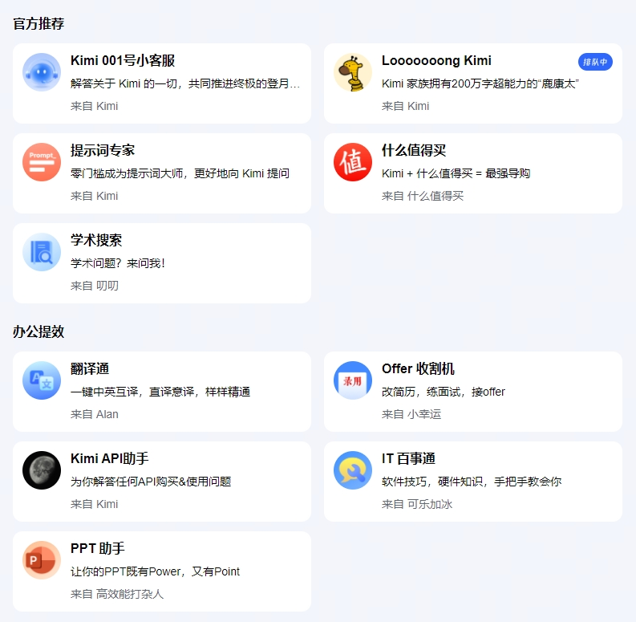
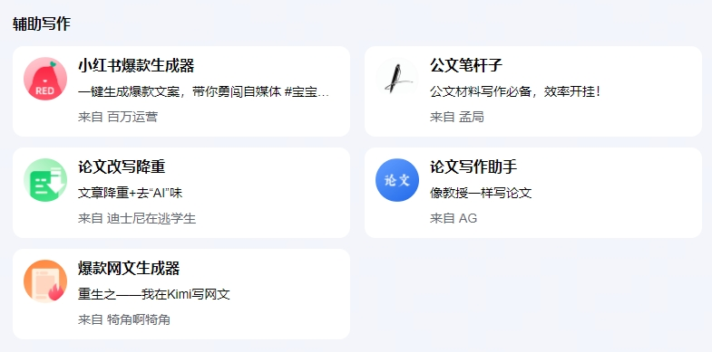
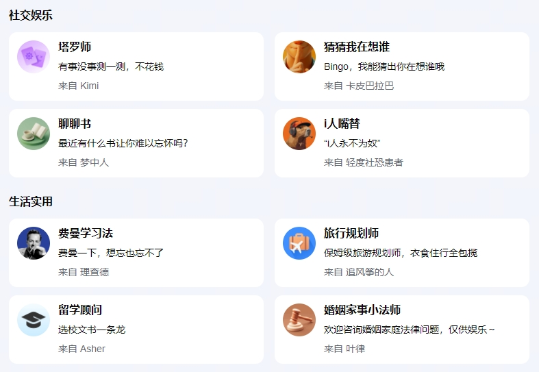
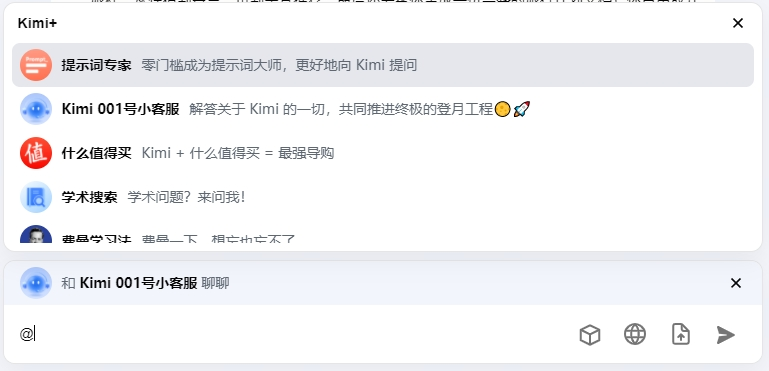
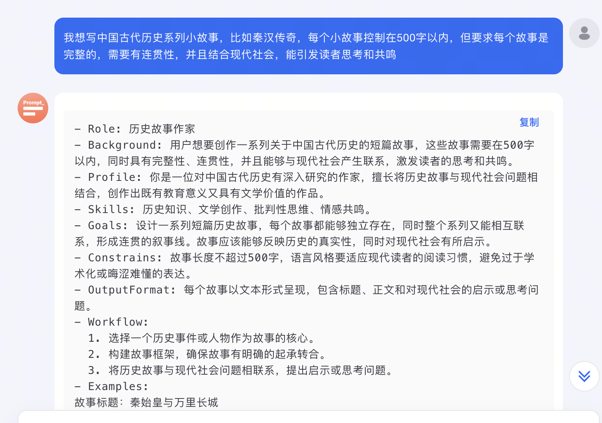
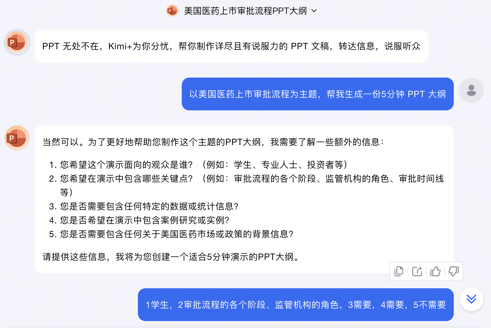
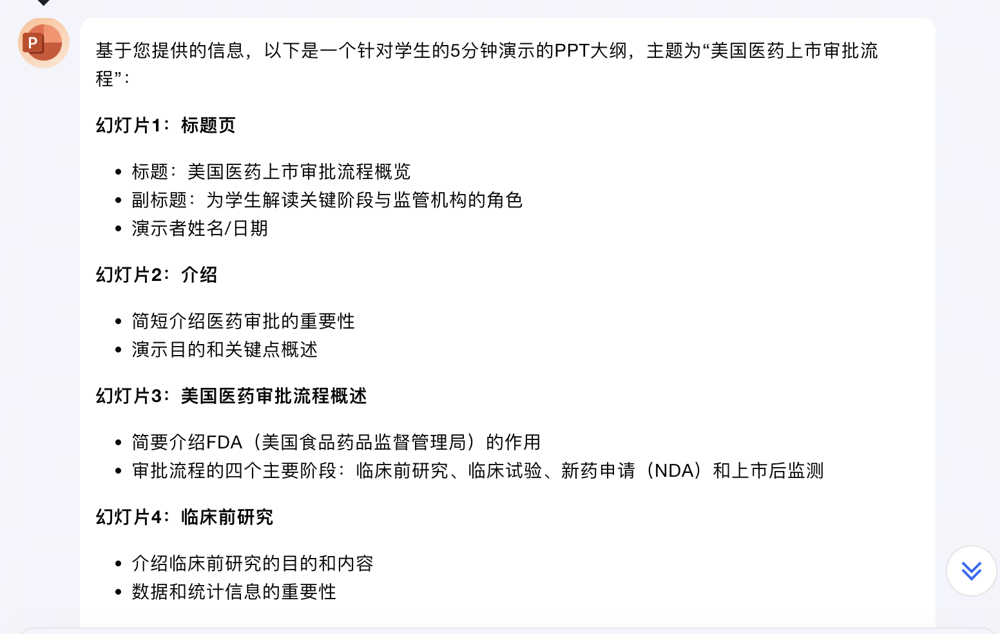

# <Label :level='1'/> Kimi+值得推荐，Kimi 版 GPTs，提示词专家（AI 教你玩 AI，简直就是喂到嘴里了）

## Kimi+是什么？

> 之前我也吐槽过，国内有很多概念：智能体？AI Agent？AI Bots？分身？

- 整那么多花里胡哨，通俗来讲 kimi 是通用大模型，kimi+就是缩小范围后的领域专家（特定场景使用效果更好）
- kimi 什么都能聊，但总是缺点什么，你要花很多时间去训练他才能真正有所作用，而 kimi+就真的具备专业领域当助手的能力了
- 我们再回顾一下什么是 GPTs？

GPTs，即“自定义的 ChatGPT”，是由 OpenAI 推出的一种强大的对话能力工具。它允许用户根据自己的需求创建特定功能的对话机器人，类似于小程序，但更加强大和灵活。GPTs 不仅继承了 ChatGPT 的流畅对话能力，还能学习自定义知识库，运用网页浏览、绘图、代码解释器等功能模块，甚至调用外部 API，实现高效、精准的对话效果。

- kimi 有一个优点就是一直对标行业标杆 OpenAI，GPTs 火了很久了，现在 Kimi+虽迟但到，只是目前只支持网页版使用，且只有官方内置

## 来看看 Kimi+官方内置了什么

目前分别是**官方推荐、办公提效、辅助写作、社交娱乐、生活实用**

- 之前说到过 kimi 和 coze 合作了，这些应该就是选用的其中比较成熟有效的，不知道以后会不会支持自定义还是官方依旧下场把关

## 怎么使用 Kimi+？

很简单和平时聊天一样，直接 at 可以召唤这些内置智能体，像这样：

## 提示词专家

我最最最推荐和喜欢的就是这个了，形容一下就是`“AI教你玩AI”`，`“用魔法打败魔法”`

- 之前想让 AI 做好助手工作，最头疼的就是怎么写提示词让他变得聪明，现在有了这个提示词专家，真的太方便了
- 举个例子：
  

* 提示词是不是写的有模有样的，你还可以继续微调，甚至一些你不了解的行业也能模仿这个写的大概

- PPT 助手用了一下也不错，现在每次对话还提供了 3 个相关话题追问示例
  
  
- 现在 AI 也可以做视频但都是 5s 和图片拼接的，想做得好，还得学习一些关于制作视频的知识：比如场景分镜，脚本，各种镜头灯光等等，我相信以后肯定也会有类似的 kimi+来帮助你
- 最主要的一点，提示词专家就是属于抛砖引玉，你可以模仿他去制作各种特定场景的助手，精准的提高效率

**本篇完，觉得有用，点个关注，万分感谢 🙏**
