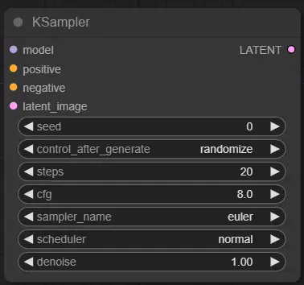

# <Label :level='1'/>从 ComfyUI 的默认工作流拆解学习中，更好的掌握 Stable Diffusion 的工作原理

> 理论上，SDXL 1.0 应该在具有 8GB VRAM 的 GPU 上有效工作。但 sd-webui 现在做不到（需要 10G）,能做到的只有 ComfyUI.ComfyUI 是一款易于上手的工作流设计工具，具有以下特点：基于工作流节点设计，可视化工作流搭建，快速切换工作流，对显存占用小，速度快，支持多种插件，如 ADetailer、Controlnet 和 AnimateDIFF 等。

## 一句话介绍

- 一款基于 Stable Diffusion 的开源框架
- 一款 React 制作的优雅的前端界面
- 节点式工作流设计，精准控制每一个节点，可以用更小的内存跑质量更高的图
- 工作流与 sd 工作原理一一对应，更容易理解 sd 模型原理

## 与 WebUI 对比

先看两张图：上面是 ComfyUI 界面，下面是 WebUI 界面

<!--  -->

- 乍一看感觉 ComfyUI 很复杂是不是
- 首先 WebUI 和 ComfyUI 底层都是基于 Stable Diffusion 的开源项目
- 目的就是提供操作界面，方便我们更好的使用 Stable Diffusion 模型
- WebUI 就像一个黑盒，使用者不知道程序究竟在做什么，也不知道具体进行到一步，只能等待最终结果，可以用暴露出来的一些参数进行调整，但是每次调整都要重新抽奖
- 而 ComfyUI 相当于没有包装的机器，所有零件都暴露在你面前，它允许你精准控制调整每一个环节，你可以清楚的知道它进行到哪一步，哪一步出了问题，可以选择某一环节重新绘制。当你掌握了它，一定会为它优雅的设计兴奋不已

## 顺着 ComfyUI 工作流节点设计学习原理

先看一下，启动之后的界面

<!--  -->

- 没错界面当然是英文的，不过也有中文插件，[github 地址](https://github.com/AIGODLIKE/AIGODLIKE-ComfyUI-Translation)
- 功能区最上方的 save 和 load 分别是保存工作流和载入工作流，Load Defult 加载默认的工作流
- 功能区下方有一个 Manger 按钮，这是一个管理插件的插件，可以很方便的安装其他拓展，本篇不展开
- 先来看看默认工作流
  <!--  -->

* 把它们分成 4 块，分别是 1 选一个大模型 2 写提示词 3 调整步数、选择采样器 4 出图，是不是和 WebUI 一样

### 学习默认工作流

- 首先了解一下文生图大致过程原理：系统在潜空间内生成一张随机种子噪声图，并在采样器等的引导下一步步去噪，我们输入的提示词会被 Clip 编码后参与调节，从而更好的对图片作引导，生成一张符合描述的潜空间语义向量的图片，然后需要经过 VAE 解码回到像素空间，最终才能变成我们眼里的图片。
- 在 ComfyUI 中一切都是节点，有输出一定有输入
- 第一个叫 Load Checkpoint 的节点，就是加载 SD 大模型，它有三个输出节点：MODEL, CLIP 和 VAE。
<!-- -  -->
- MODEL 就是载入的大模型；
- CLIP 它包含了文本编码器，用来将我们输入的提示词转换成机器可以理解的文本向量，用它连接第二个叫 Clip Text Encode 节点
- 我们在 Clip Text Encode 节点输入的就是提示词（prompt），因为我们要写正向和负向两种所以创建 2 个 Clip Text Encode 节点，输入都是连接 CLIP 节点，不同之处在于我们将被 CLIP 转换后的输出部分叫 Conditioning，连接到不同的地方就行
<!-- -  -->
- 接下来轮到处理图片的节点 KSampler 上场，KSampler 相当于潜空间，区别于像素空间，是一块我们不可见的压缩空间，在这里图片的处理速度更快。在这里我们要决定随机种子、步数、CFG、采样器等 WebUI 中的各项参数。KSampler 接收的变量有 model, positive, negative, latent_image，其中 model 就是大模型加载器传来的，连接点颜色是紫色；positive 和 negative 连接前面的 Conditioning，分别表示正向提示词和反向提示词，连接点颜色是黄色。
<!-- -  -->
- 还有一个 latent_image 节点没有连接，处理图片的过程中有一个叫“随机种子噪声图”的东西，这个噪声图是通过在一张空白图上添加指定强度的噪声而形成的。这张空白图就是 latent_image。
- 因为默认工作流对应的是文生图，所以我们用的是 Empty Latent Image 节点，它决定了最终图片的尺寸
<!-- -  -->
- 既然它需要的输入是一张空白图，那么当我们把这个 Empty Latent Image 节点换成 Load image 节点会怎么样呢，那就变成图生图工作流啦，当然它还需要加一个 VAE Encode 节点来编码，可以看下图 Load image 的输出是图片和蒙版，不能进入 KSampler 潜空间，通过 VAE Encode 节点后输出就变成 Latent 啦，是不是很优雅，感觉自己在造汽车。
<!-- -  -->
- 忘记图生图，我们需要回到 KSampler 节点，它的后面是连接 VAE 用来解码，把图片从潜空间拉回像素空间。这次是 VAE Decode 哦，不要和 VAE Encode 搞混了。它们红色的 vae 节点都是连接第一个说到的大模型上的 VAE 输出节点的
<!-- -  -->

* 最终图片就通过 IMAGE 节点回到了像素空间。IMAGE 节点之后可以添加一个 Save Image 节点来保存图片。

<!-- -  -->

- 点击右侧功能区 Queue Prompt，就会开始运行工作流
- 以上就是整个默认工作流的拆解介绍，看到这里是不是突然觉得 ComfyUI 好像更简单更好用
- 接下来就可以开始自己探索设计工作流了，也可以和别人交流，导入别人的工作流来用。
