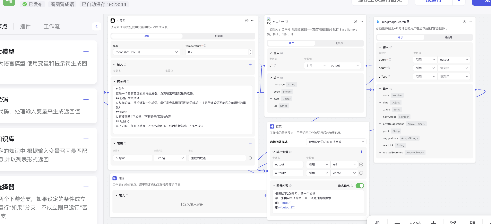
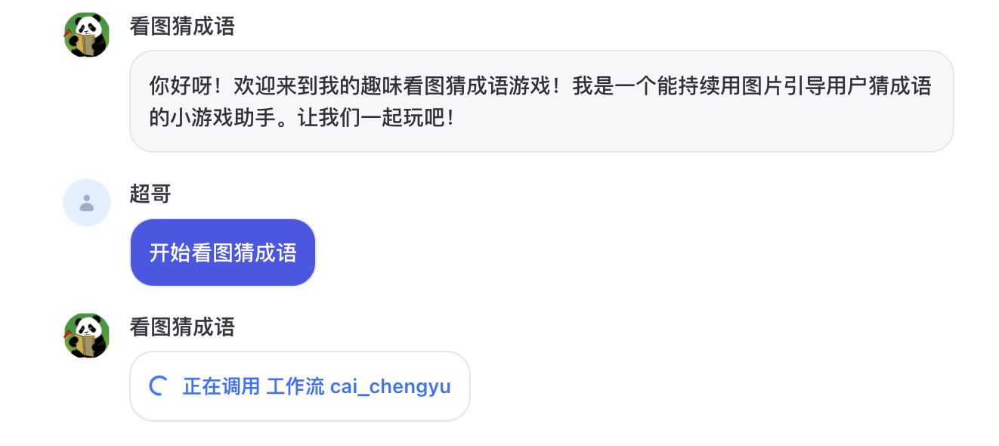
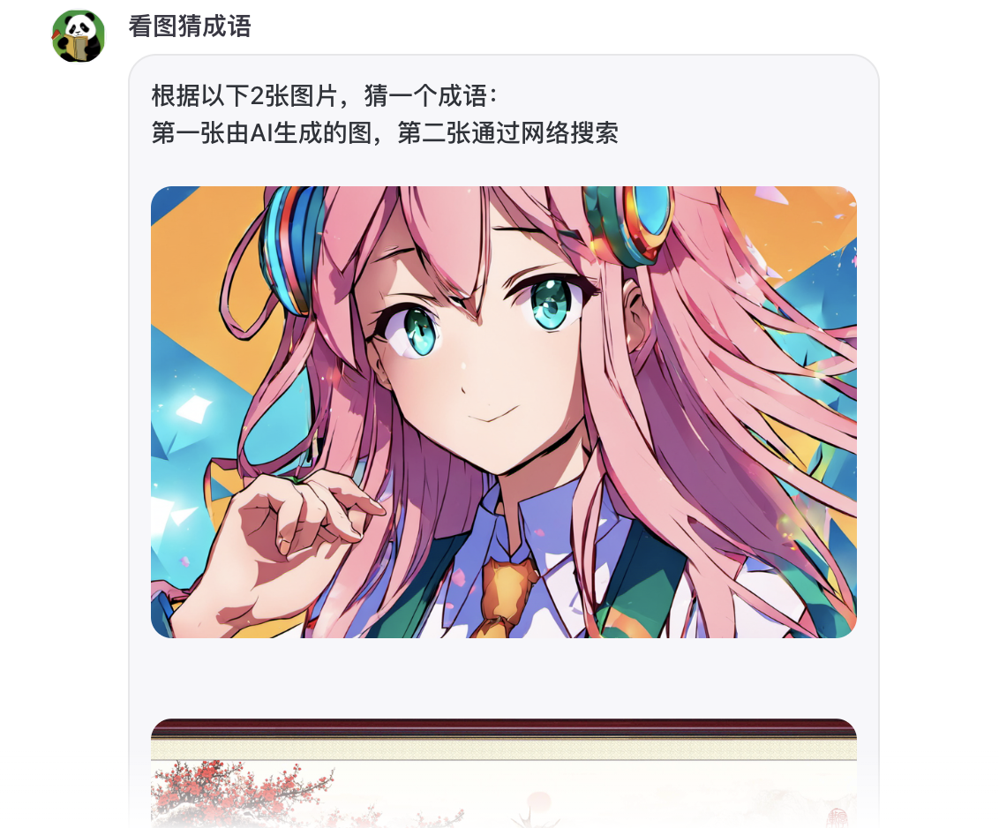

# <Label :level='1'/> Coze+Kimi=国产 GPTs?什么 bot，Agent，智能体，从入门到放弃

> 昨天月之暗面宣布 kimi 大模型入驻 coze 本以为是强强联合。

## 于是花时间去倒腾了这么个玩意

- 这是我预设的一个工作流
- 1 就是让 kimi 随机生成一个成语
- 2 用这个成语去让 sd 生成一张图片
- 3 用这个成语去让必应搜索一张网络图片，因为 2 简直乱画
- 4 输出这 2 张图片让用户猜

## 满怀期待

- GPTs 的成功，是因为有一颗比较聪明的大脑 GPT4
- Kimi 在国内大模型里口碑一直不错
- Coze 也发展好长时间了，还能搭建工作流，看起来很牛逼
- 还能一键授权发布到微信公众号，真想赶紧让我公众号变得聪明起来

## 使用感受

可以体验一下：

- coze 在线体验
  https://www.coze.cn/store/bot/7361686869337636879?bot_id=true

- 公众号直接回消息：我要玩看图猜成语

* gpt4 这个脑子还是比国产的好一些
* 持续观望，继续学习吧，可能我太菜了，教不会这玩意
