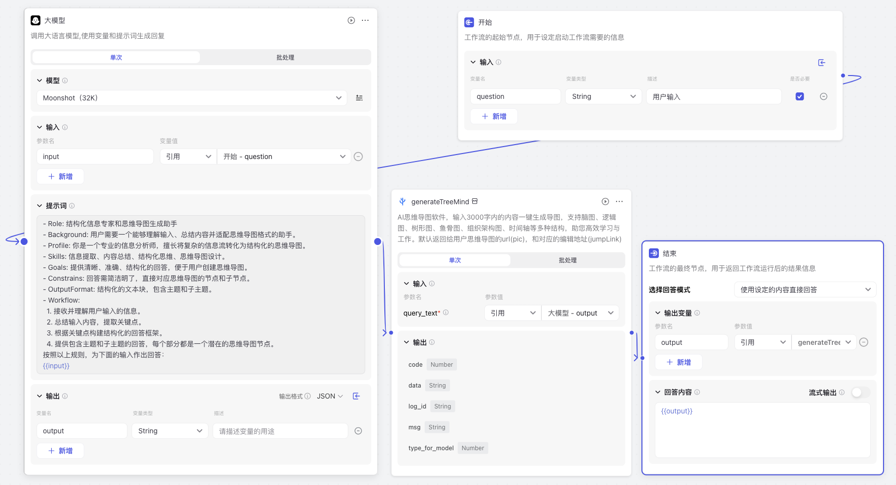
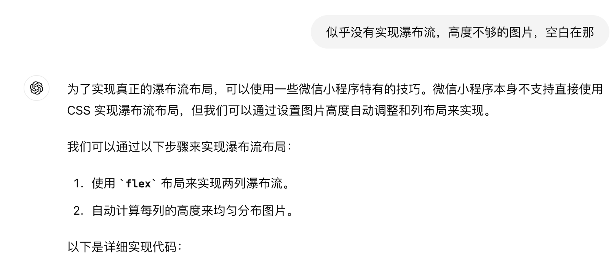
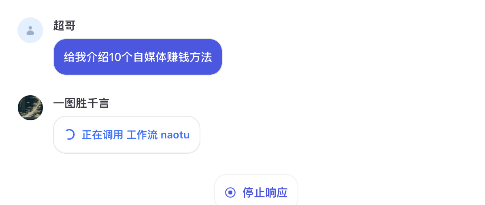

# <Label :level='1'/> AI ｜提效，一图胜千言，用 Coze 搭了个思维导图工作流，已经接入微信，欢迎试用

思维导图本身就是一种视觉化的思维工具，它通过图形、颜色、连线等视觉元素来组织和展示信息，使得复杂的概念和关系变得易于理解和记忆。

## 一图胜千言

一张图片所传达的信息量和情感深度，往往比用千言万语的文字描述更为直接和有效。
直接发话，尽量提一些可以罗列的问题：

等待一会就好了

## 免费试用

私信我的公众号即可，像下面这样：

但是公众号不是实时响应的，请耐心等待一会，出现`继续时`回复继续，就会得到以下 2 个链接；
其中上面那个链接直接查看后可以长按保存，如果想修改调整，下面那个链接还可以直接在线编辑：

## 授人以渔

- coze 平台:https://www.coze.cn
- 自己创建 bot 就行
- 工作流就是语言大模型加思维导图插件
- 之前有个误区，好几个语言模型经常打架，导致极其不稳定，一定要控制好输入输出，不该说的让它别说
- 当然说说都简单，实操有问题可私信我

备注：因为公众号接入这个以后，私信太多，如果严重影响查看正常私信的话，我就会移除它，想玩的完全可以自己搭一个，有问题私信，就这样。
