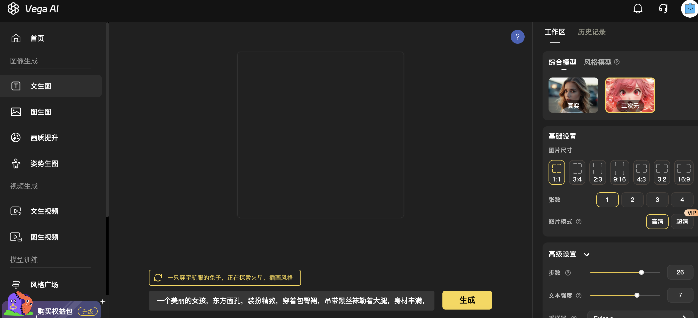

# <Label :level='1'/>AI 画图免费在线试玩网站

> 之前本地部署了，开源免费，自主控制的 Stable-Diffusion，这次分享一些可以在线免费试玩的网站

## 国内的

### Vega

每天出图数量没有任何限制，但限制速度，目前为止，基本是免费，有一些付费点也无关紧要，如加速服务，图生视频（这个功能有点差，尝个鲜吧）

- 网址：[https://www.vegaai.net/](https://www.vegaai.net/)
- 优点：支持中文提示词，UI 界面也是中文的，可以快速上手试玩，推荐新手使用
- 缺点：底层还是 Stable-Diffusion，用起来方便的同时，就肯定损失了自由度
- 界面长这样：

### 哩布立布

因为墙的存在，外面有的，必然要搬运一份，这是仿+搬运 c 站（国外篇讲）的，UI 就像本地 SD 装了中文插件

- 网址：[https://www.liblib.ai/](https://www.liblib.ai/)
- 优点：同 Vega，但是模型多一些，我觉得用下来，出图的质量也好一点，每日免费算力 300，玩一玩其实也够了
- 缺点：也同 Vega，本质上都是汉化版 Stable-Diffusion
- 界面是这样的：
  

- 点击在线生成，就会打开下面类似 Stable-Diffusion 的界面，可选模型可以在模型广场选，也能直接抄人家的参数，不用自己下载和部署模型啊插件啊，用起来还是挺方便的

其实国内还有很多网站，但是大同小异，就不一一介绍了，按我的理解早晚都会调整计费，趁着免费赶紧玩哈哈，同时也最好自己部署一套 Stable-Diffusion，毕竟开源｜免费｜发展神速｜第一手尝鲜｜不受制于人｜等等

## 国外的

对网络有要求，还请自行摸索

### civitai(c 站)

上面说到的 c 站，置顶推荐，如下图：

- 网址：[https://civitai.com/](https://civitai.com/)

### DALL ·E 2

openAI 的产品，也可以顺带玩一玩 ChatGPT

- 试玩：
- [https://openai.com/dall-e-2/](https://openai.com/dall-e-2/)

### Midjourney

质量不错，但是收费

- 试玩：
- [https://discord.gg/midjourney](https://discord.gg/midjourney)
