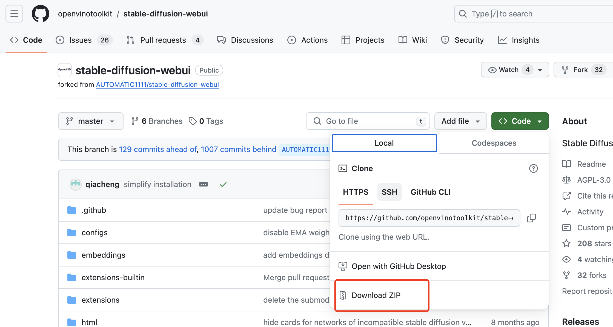
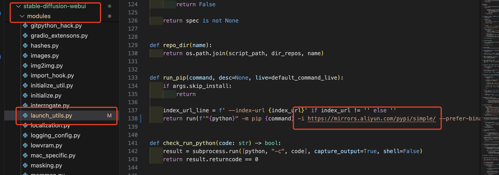
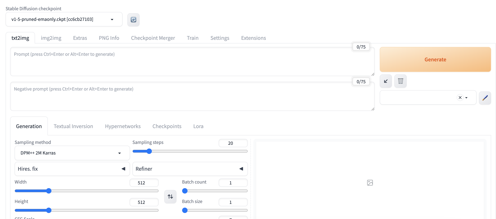

# <Label :level='1'/>Mac 本地部署#AI 绘图 stable-diffusion-webui（Intel 版）

> 其实 2024 年了，教怎么部署的文章已经很多了，但我实操一下，还是很多坑，因此记录一下
> 这篇文章[手把手教你在 Mac 上部署 stable-diffusion，晋级高阶 AI 绘图及模型训练](https://zhuanlan.zhihu.com/p/637067918)讲的很详细，但实际跑不起来，因此着重描述下部署问题

## 系统配置

Stable Diffusion WebUI 当然支持 Windows/Linux，也适配三种芯片

- NVidia (recommended)
- AMD GPUs、Intel CPUs,
- Intel GPUs (both integrated and discrete)

**我的配置如下：**

- 系统：MacOS（14.3.1 我最新更新的，应该关系不大）
- Python：3.10.6（就装这个版本，因为 stable-diffusion-webui 是用这个构建的，其他版本不一定行）
- 显卡：Intel Iris Plus Graphics 645 1536 MB（这个坑挺大的）

**注意以下部署就是按照 mac 的英特尔显卡，不同配置有所不同**

## 直奔主题，开始部署

### 1、安装 Homebrew（便捷安装 Mac 软件的插件）

依次打开“启动台-其他-终端，在“终端”中输入：`/bin/bash -c "$(curl -fsSL https://raw.githubusercontent.com/Homebrew/install/HEAD/install.sh)"` 输入密码（密码不会显示），按回车，然后继续按提示“回车”，等待自动安装完成

### 2、 安装 python3.10.6

终端输入`brew install cmake protobuf rust python@3.10.6 git wget`这里面装了很多，可能还会要求你更新 xcode，反正按提示安装，终端输入`xcode-select --install`

### 3、 克隆安装 webui 软件

- 根据[Installation on Intel Silicon](https://github.com/openvinotoolkit/stable-diffusion-webui/wiki/Installation-on-Intel-Silicon)，我们选择在“终端”中输入：`git clone https://github.com/openvinotoolkit/stable-diffusion-webui.git`，然后回车等待自动安装完成，这里就用到了上面安装的 git，如果实在用不来，也可以直接去 github 网站上，download 这个项目的压缩包直接解压即可

* 虽然`AUTOMATIC1111`才是主仓库且已经更新到 1.8 版本，但是我看最新版没有了`OpenVINO`这个自定义脚本，所以我们就选择了`openvinotoolkit`，这个仓库还是 1.6 版本
* 接着安装项目运行所需依赖

```cmd
cd stable-diffusion-webui
./webui.sh
```

- 上面代码将自动安装依赖，这时候会遇到很多报错，首先解决网络问题，能科学上网的自不必说，也可以将 python 源换为国内镜像

```
cd ~
mkdir .pip

cd .pip
touch pip.conf

在pip.conf文件中，添加以下内容：

[global]
index-url = https://pypi.doubanio.com/simple/
trusted-host = pypi.doubanio.com
```

- 或直接在源码里加也是可以的，如下图，找到`stable-diffusion-webui/modules/launch_utils.py`第 138 行，增加"-i https://mirrors.aliyun.com/pypi/simple/"
  

* 安装会遇到各种问题，详见下一章，安装完成后，还要下载模型然后导入（直接放进对应文件夹，可以参考最上面的文章）

### 4、常见问题处理

#### 4.1 缺少 openai 模块等

```js
OSError: Can't load tokenizer for 'openai/clip-vit-large-patch14'. If you were trying to load it from 'https://huggingface.co/models', make sure you don't have a local directory with the same name. Otherwise, make sure 'openai/clip-vit-large-patch14' is the correct path to a directory containing all relevant files for a CLIPTokenizer tokenizer.

// 遇到如上报错，需要安装'openai/clip-vit-large-patch14'
//在stable-diffusion-webui项目下，创建openai文件夹
mkdir openai
git clone https://huggingface.co/openai/clip-vit-large-patch14
```

#### 4.2 `ModuleNotFoundError: No module named '_lzma'`

```
brew install xz
pip install backports.lzma
```

#### 4.3 `OSError: We couldn't connect to 'https://huggingface.co' .......`

- 这主要是因为连不上`https://huggingface.co`，启动时很多地方会去请求这个网站，下载模型也会去请求这个网站，有时候即使科学上网也不好使
- 于是我们还是切换源,在终端输入下面 3 句，第一句是切换镜像源，下 2 句是英特尔 CPU+GPU 的场景执行前环境要生效的内容

```js
export HF_ENDPOINT=https://hf-mirror.com
export PYTORCH_TRACING_MODE=TORCHFX
export COMMANDLINE_ARGS="--skip-torch-cuda-test --precision full --no-half"
```

## 启动

- `./webui.sh --precision full --no-half`
- 即使切换了源可以下载，也建议自行下载好模型后放入文件夹，因为模型都比较大
- 然后 lora 模型，插件配置等，还是建议参考[手把手教你在 Mac 上部署 stable-diffusion，晋级高阶 AI 绘图及模型训练](https://zhuanlan.zhihu.com/p/637067918)


