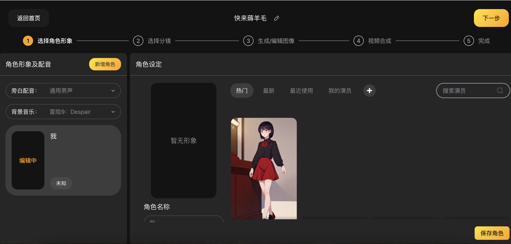

# <Label :level='1'/> 分享一个在线可以用 AI 生成漫画的网站

> 目前是免费，快去薅羊毛

## 废话少说，点开始创作，直接开始

## 然后一句话一句话的描述

## 选风格

## 然后选角色，可以一定程度保持角色一致性

## 然后选分镜，可以控制一下人物镜头，但目前最多 2 个角色入画

## 然后就生成图片，某一张不满意可以重画

## 最后就合成视频好了

### 体验了一下，是有进步了，流程看起来还挺不错，但是缺点依然很多：

- 图文关联性，视频动态幅度，角色一致性...等等，这是老问题就不说了。
- 还有一点配音我也不太满意，不过精益求精的小伙伴可以靠视频剪辑工具，或者 ai 技术另外配音或合成
- 最后祝大家玩的愉快，顺手点个关注，网址是https://brmgo.com/
