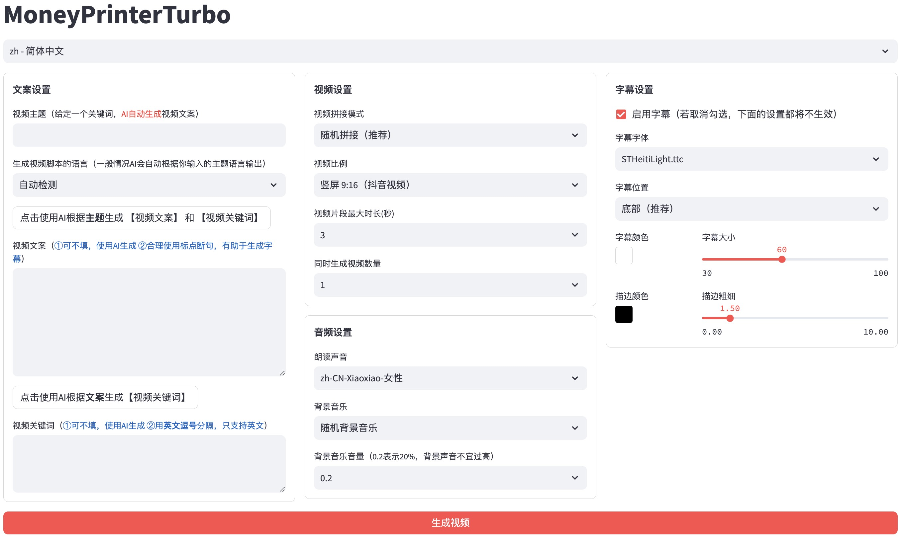

# <Label :level='1'/> AI 制作短片，解放生产力

> 目前是 AI 的爆发式发展，百家争鸣的时代，各类 AI 工具层出不穷，可以说每天都在变化发展

## 为什么会做这个

### 首先，是出于对 AI 的极大兴趣

- 最近都在：

1. 学习了解各种 AI 应用，
2. 补习一些 AI 知识，
3. 看一些 AI 项目的代码，
4. 看一些 AI 作品

- 以此来建立自己于 AI 的认知和知识体系，跟上时代发展的步伐

### 其次，是偶然看到了这样的一个作品

- 我不评价这个视频的内容是否优秀，只关注表现形式
- 他就是一个黑片，循环播放一些文字
- 就是这样极其简陋的一个视频，播放量高达 65 万

### 最后，是又又又正好了解到了一个开源项目可以文生视频

- [github 地址](https://github.com/harry0703/MoneyPrinterTurbo)
- 完整的 MVC 架构，代码 结构清晰，易于维护，支持 API 和 Web 界面
- 支持视频文案 AI 自动生成，也可以自定义文案
- 支持多种 高清视频 尺寸
- 竖屏 9:16，1080x1920
- 横屏 16:9，1920x1080
- 支持 批量视频生成，可以一次生成多个视频，然后选择一个最满意的
- 支持 视频片段时长设置，方便调节素材切换频率
- 支持 中文 和 英文 视频文案
- 支持 多种语音 合成
- 支持 字幕生成，可以调整 字体、位置、颜色、大小，同时支持字幕描边设置
- 支持 背景音乐，随机或者指定音乐文件，可设置背景音乐音量
- 视频素材来源 高清，而且 无版权
- 支持 OpenAI、moonshot、Azure、gpt4free、one-api、通义千问、Google Gemini 等多种模型接入

### 于是，我打算用这个开源项目制作一个短视频试试

## 制作短片过程

### 先整一段文案

- 就用 kimi 来生成好了
- 我随便想了个话题《课外补习文化对孩子的影响是什么？》，对话如下：
  

* 马马虎虎吧，就用这个吧，如果你有好的想法，可以自己润色，或者继续让 kimi 修改，就类似《教你怎么用 chatgpt》的文章，就不展开了

### 生成视频

- 项目部署就不说了，github 上都有，目前也有免费的 demo 网站试玩（以后不好说~~肯定收费~~）
  
  

* 直接就用这个文案作为台词，直接让 AI 生成视频和字幕，顺带配音

- 我选择的是竖屏 9:16，可以看看效果[《课外补习文化对孩子的影响是什么？》](https://www.bilibili.com/video/BV1VM4m197VM/?vd_source=25538f327d9fbb263586d70d99356b17)

### 有话要说，优缺点比较

- AI 的发展已经停不下来了，虽然 AI 还存在很多问题，比如画面和文案关联度并不高，但是问题不大
- 这次的小试牛刀，可以看出来，至少比黑片好看点
- 如果说要和精心剪辑的短片比的话
- 那我们可以从《解放生产力》的角度谈一谈
- 首先通过 AI 工具解放生产力这一点毋庸置疑了，我们就以短片的文案、画面、配音三要素为主，如果你想精益求精，也是可以的，如果你懂代码可以直接选定合适的配音（包括声音模拟和背景音乐），文案可以自己润色，画面可以自己拍摄+剪辑
- 如果不懂代码，那就等 AI 越来越聪明，然后你抽盲盒，目前很多 AI 制作都是靠抽盲盒爆肝式选择好的素材
- 让我们继续努力...
