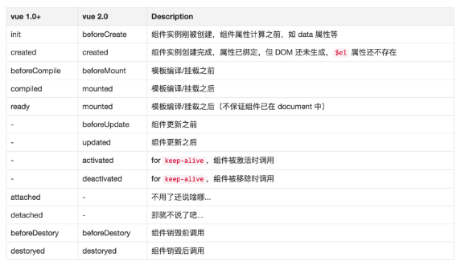

# <Label :level='3'/>Vue 语法整理

## 一、基础语法

```js
new Vue({
  el: '#app',
  data: {
    message: 'Hello Vue!'
  }
});
```

- `el`表示在`html`中哪个部分起作用，类似节点选择器；
- `data`中定义了页面需要的数据，键值对；
  现在来“驱动”视图，body 标签里面加入：

```html
<div id="app">
  {{message}}
</div>
```

## 二、事件

```html
<div id="app">
  {{message}}
  <button v-on:click="changeMessage">改变message</button>
</div>
```

- `v-`是指令
- `v-on`是绑定事件，可以简写成`@click`
- 传参数的事件方法

#### 事件修饰器

```html
<!-- 阻止点击事件的冒泡行为 -->
<a v-on:click.stop="doThis"></a>
<!-- 阻止默认的表单提交 -->
<form v-on:submit.prevent="onSubmit"></form>
<!-- 事件修饰器可以连用 -->
<a v-on:click.stop.prevent="doThat">
  <!-- 只需要修饰器，而无需处理方法 -->
  <form v-on:submit.prevent></form>
  <!-- 使用 capture 模式-->
  <div v-on:click.capture="doThis">...</div>
  <!-- 仅当event.target是自身的时候才执行 -->
  <!-- 比如，这样写了之后点击子元素就不会执行后续逻辑 -->
  <div v-on:click.self="doThat">...</div></a
>
```

## 三、双向绑定

```html
<div id="app">
  <p>{{message}}</p>
  <input v-model="message" />
</div>
```

- `v-model`是用在表单中的指令
- 双向绑定：都是指的是类似 input 这样的，自带`change`事件的表单项目
- `p`标签中的`message`发生了变化，`input`的`value`的变化改变了`message`，从而使视图发生了相应的变化。

## 四、循环

- 带有`key`，`index`，`value`的完整版循环

```html
<ol>
  <li v-for="todo in todos">
    {{todo.text}}
  </li>
</ol>
```

#### 修饰器方法

```js
push(); //在结尾增加一条或多条数据
pop(); //删除最后一条数据
shift(); //删除第一条数据，并返回这条数据
unshift(); //在开始增加一条或多条数据，并返回数组长度
splice(); //向/从数组中添加/删除项目，然后返回被删除的项目。
sort(); //对数组的元素进行排序。
reverse(); //颠倒数组中元素的顺序。
filter(); //返回条件为真的数据
concat(); //连接两个或多个数组
slice(); //从已有的数组中返回选定的元素。
```

## 五、vm 对象

```js
var vm = new Vue({
  el: '#app',
  data: {
    message: 'Hello Vue!'
  }
});
console.log(vm.messages);
console.log(vm.$data.message);
console.log(vm.$data);
console.log(vm.$el);
```

## 六、vue1.0 与 2.0 的生命周期



## 七、过滤器

```html
<div id="app">
  {{ float_number | toInt }}
</div>
new Vue({ el: '#app', data: { float_number: 3433.45 }, filters: { toInt: function (value) { return
parseInt(value); } } })
```

## 八、在{{}}中运行表达式

```html
<div id="app">
  {{ ok ? 'yes' : 'no' }}
</div>
<script src="vue.min.js"></script>
<script>
  new Vue({
    el: '#app',
    data: {
      ok: true
    }
  });
</script>
```

它一般表达的是运算关系；如果运算很简单，一次性的，你可以不用 filter，而采用这种简短的写法；

## 九、指令

```html
v-text = "" v-html = "" v-on = ""
```

## 十、属性 v-bind

```html
<div id="app">
  <div class="active" v-bind:class="{red:isActive}">sadasdsad</div>
  <div class="active" :class="{red:isActive}">sadasdsad</div>
  <!--简写方式-->
</div>
<script>
  new Vue({
    el: '#app',
    data: {
      isActive: true,
      hasError: false
    }
  });
</script>
```

- `bind`是专门用来绑定 html 原生属性的
- 绑定 html 已有的属性，比如：`class`、`style`、`src`、`href`
- 可以跟普通的属性共存
- 直接绑定一个对象，也可以绑定一个数组

## 十一、修饰器

```html
<form v-on:submit.prevent="onSubmit"></form>
```

它们一般都带有一些特殊功能

## 十二、计算属性

```html
<div id="app">
  {{ int_number }}
</div>
<script src="vue.min.js"></script>
<script>
  new Vue({
    el: '#app',
    data: {
      float_number: 3433.45
    },
    computed: {
      int_number: function () {
        return parseInt(this.float_number);
      }
    }
  });
</script>
```

- 计算属性是一种更直观，更清晰的表达方式。
- 在写表达式很长，或者多行的情况下，都建议使用计算属性
- 计算属性作为一种数据属性，它依赖`data`里面的数据，如果`data`里面的数据不变，计算属性可以根据`data`属性源的变化自动缓存
- 在数据和运算量庞大的应用里，合理的使用计算属性可以大大提高效率

## 十三、method

```html
<div id="app">
  {{toInt()}}
</div>
<script src="vue.min.js"></script>
<script>
  new Vue({
    el: '#app',
    data: {
      float_number: 3433.45
    },
    methods: {
      toInt: function () {
        return parseInt(this.float_number);
      }
    }
  });
</script>
```

- 用一个方法来代替计算属性，其结果是一模一样的
- 而 methods 里面的方法是每次都会运行一次

## 十四、v-if、v-show

```html
<div id="app">
  <div v-if="ok">v-if</div>
  <div v-show="ok">v-show</div>
</div>
<script>
  new Vue({
    el: '#app',
    data: {
      ok: true
    }
  });
</script>
```

- `v-if`需要渲染`dom`，因此切换速度上比`v-show`慢
- `v-show`的`dom`需要预先加载，因此初次加载量比`v-if`大
- 如果要频繁切换显示隐藏，就用`v-show`
- 如果要提高整个页面的加载速度，就用`v-if`

## 十五、表单绑定

```html
<div id="app">
  <select v-model="selected">
    <option v-for="option in options" v-bind:value="option.value">
      {{ option.text }}
    </option>
  </select>
  <span>Selected: {{ selected }}</span>
</div>
<script>
  new Vue({
    el: '#app',
    data: {
      selected: 'A',
      options: [
        { text: 'One', value: 'A' },
        { text: 'Two', value: 'B' },
        { text: 'Three', value: 'C' }
      ]
    }
  });
</script>
```

- 必须要使用`v-model`才能双向绑定
- `Lazy`，不同步`v-model.lazy="msg"`
- 当选中表单元素时，单选和多项如果没有`value`是切换`true`和`false`，否则会显示`value`里的值，下拉菜单会显示`option`里的属性
- 自动转化数字，`v-model.number="age"`
- 自动去除字符串首尾空格，`v-model.trim="msg"`

## 十六、组件

```html
<div id="app">
  <my-component></my-component>
</div>
<script>
  Vue.component('my-component', {
    // 全局注册
    template: '<div>A custom component!</div>'
  });
  var vm = new Vue({
    el: '#app'
  });
</script>
<script>
  var Child = {
    template: '<div>A custom component!</div>'
  };

  var vm = new Vue({
    el: '#app',
    components: {
      'my-component': Child // 局部注册
    }
  });
</script>
<script>
  Vue.component('simple-counter', {
    template: '<button v-on:click="counter += 1">{{ counter }}</button>',
    data: function () {
      return {
        counter: 0
      };
    }
  });
  new Vue({
    el: '#app'
  });
</script>
<script>
  Vue.component('my-component', {
    props: ['myMessage'],
    template: '<span>{{myMessage}}</span>'
  });
</script>
```

- `Vue组件`注册要写在前面，`Vue实例`初始化要写在后面
- 在组件里`data`的属性一定要`return`回来
- `template`里面可以直接使用`v-on`这样的语句
- 组件里面当然可以嵌套的组件，这就形成了父组件和子组件的关系。
- 子组件想使用父组件的数据，就需要通过传参数的方式。
- 参数往下传，事件往上传
- 在`html`不能用驼峰命名，因为`html`的属性是区分大小写的
- `type`参数`String|Number|Boolean|Function|Object|Array`

## 十七、Vue-loader

1. `vue-loader`可以让你换一种方式来定义组件，它必须配合打包工具`webpack`来一起使用；
2. 组件变得完全独立，调用和管理都十分方便
3. `Webpack`是一个模块化的打包工具，它基于 node.js
4. `Webpack`广泛的应用在其他的`js`项目构建中
5. 把 vue 组件写成一个一个单独的文件是个绝妙的主意，但是这些文件怎么调用，怎么组合在一起，怎么管理呢？这就要靠 Webpack 了
6. `vue-loader`是`Webpack`的一个插件，专门用来管理和打包`.vue`文件的
7. `Webpack`除了可以把不同文件打包，统一加载外（这就是传说中的模块化开发），还可以对语言进行预编译（`jade`，`es5`，`sass`...）
8. `<style scoped>` ，加入`scoped`将只对这个组件有效，而不会影响全局

#### 安装 vue-cli

```bash
//全局安装vue-cli
npm install -g vue-cli
//初始化一个vue专用的webpack项目
vue init webpack-simple hello-vue
//进入项目目录
cd hello-vue
//npm安装依赖包
npm install
//文件被打包编译，并可在localhost:8080访问
npm run dev
```
