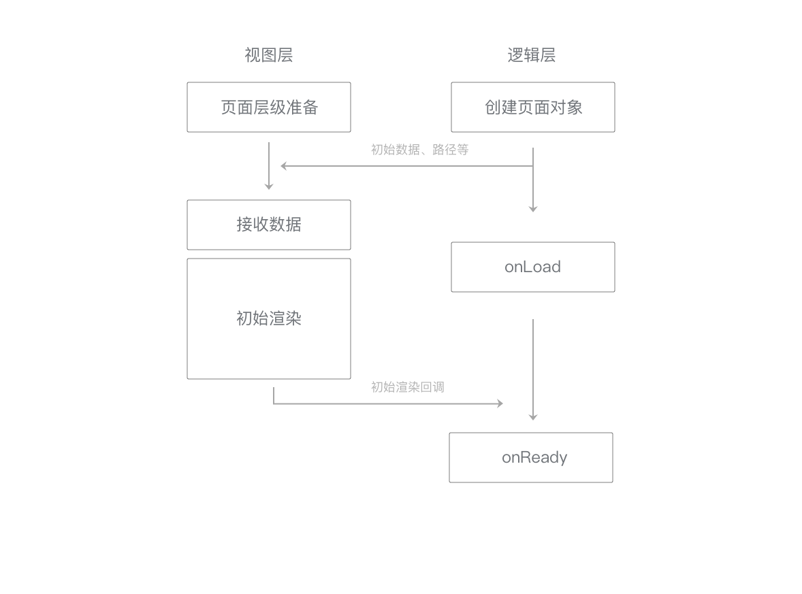
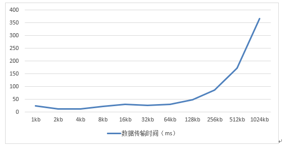
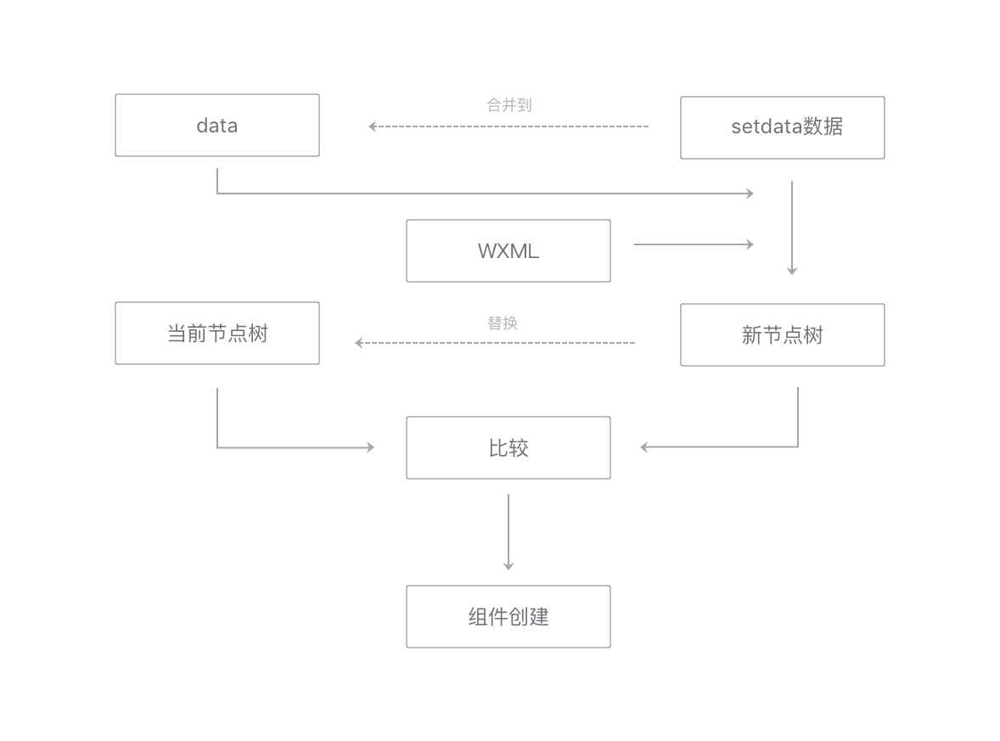
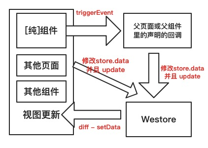

# <Label :level='1'/>小程序中的数据
::: tip 前言
上一篇文章了解了小程序的生命周期，接下来研究一下数据通信，我觉得清楚了生命周期和数据通信，就能对整个程序有一定的把控能力，定位问题和解决问题的能力将大幅提高
我刚开始撸小程序的时候，觉得看看文档就可以了，导致写了很多垃圾代码坑人坑己，相信大部分初学者也不会去仔细研究文档，更别说啰里啰嗦的指南了，在通读小程序官方指南后，我觉得很有必要为初学者总结一番，教学相长
:::

## 天生的延时
* 为了解决管控与安全问题，小程序提供了一个沙箱环境来运行开发者的JavaScript 代码
* 基于双线程模型，意味着任何数据传递都是线程间的通信
* 在小程序架构里，这一切都会变成异步
* 异步会使得各部分的运行时序变得复杂一些，因此逻辑层与渲染层需要有一定的机制保证时序正确
* 这些工作在小程序框架里会处理好，开发者只需要理解生命周期，以及控制合适的时机更新UI即可
* 上一篇文章我们学习了小程序的生命周期，本文主要理解如何控制合适的时机更新UI

## 如何控制合适的时机更新UI
小程序作为MVVM框架中的一员，数据驱动是核心，得数据者得天下
* 要理解数据通信，和生命周期、运行机制密不可分，像双线程通信模型、数据驱动、底层框架、界面渲染机制等等，本文不会展开叙述，也不可能讲的比官方文档更好、更实时
* 本文主要理解以下几点：（想了半天，才概括出个大概）
* 1、小程序中数据的作用域
* 2、合理操作数据，提升性能
* 3、组件间的数据通信
* 4、缓存数据
* 5、扩展-状态管理westore
> 在这之前，还是上几张官方的图，有个概念便于后续理解




**明确几点概念**
* 渲染层和数据相关
* 逻辑层负责产生、处理数据，小程序的JS脚本运行在同一个JsCore线程里
* 逻辑层和渲染层是一对多的关系，但页面对象（page）和页面层级（webview）一一对应
## 一、小程序中数据的作用域
#### 1、全局数据
```
// app.js
App({
  globalData: 'I am global data' // 全局共享数据
})
// 其他页面脚本other.js
var appInstance = getApp()
console.log(appInstance.globalData) // 输出: I am global data
```
* App实例是单例的，因此不同页面直接可以通过App实例下的属性来共享数据

#### 2、页面共享数据
* 简单来说就是页面所在的JS中Page构造器外定义的变量
* 执行如下示例代码以验证
```
console.log('加载 page.js')
var count = 0
Page({
  onLoad: function() {
    count += 1
    console.log('第 ' + count + ' 次启动这个页面')
  }
})
```
* 你会发现小程序启动时，打印了'加载 page.js'，每次打开这个页面，count变量会递增，不会随着页面的销毁而销毁
* 由于页面所在的JS文件、app.js和所有其他被require的JS文件，在小程序启动时自动执行并被基础库注册，所以逻辑层（看作所有js的集合）只执行一次，之后都是通过Page构造器创建Page实例来渲染页面
* 一般require的依赖或者第三方库JS以及getApp()，我们都会放在页面共享的数据中
#### 3、Page实例中的数据
* 也就是每个Page构造器中的数据，没错！这就是我们每天搬砖的地方
```
Page({
  data: { text: "我用来改变界面显示" },
  onLoad: function(options) { },
  onReady: function() { },
  onShow: function() { },
  onHide: function() { },
  onUnload: function() { },
  text: "我不显示在页面上",
  myData:{
      a: '我也不显示在页面上',
      b: true
  }
})
```
* 大家应该都知道data中的数据用来渲染页面，和VUE一样，不过VUE中只要写this.text，而小程序中要写this.data.text，每次写到这个就郁闷，其实与界面渲染无关的数据最好不要设置在data中，对性能也是大有好处
#### 4、自定义组件中的数据
* properties外部传值
* data内部数据
* emmmmmm自定义组件有必要另开一篇总结
## 二、合理操作数据，提升性能
#### 数据通信
* 页面初始数据通信：视图层在接收到初始数据data时，进行初始渲染
* 更新数据通信：视图层在接收到更新数据setData时，进行重渲染
* 用户事件通信：一个用户事件被触发，视图层会将信息反馈给逻辑层
* 一切都是2个线程通信的结果，数据量小于64KB时总时长可以控制在30ms内。传输时间与数据量大体上呈现正相关关系，传输过大的数据将使这一时间显著增加。因而减少传输数据量是降低数据传输时间的有效方式



#### 提升性能须遵循的原则
调用setData执行重渲染时，视图层将data和setData数据套用在WXML片段上，得到一个新节点树，然后与当前节点树进行比较，这样可以得到哪些节点的哪些属性需要更新、哪些节点需要添加或移除，最后，将setData数据合并到data中，并用新节点树替换旧节点树，用于下一次重渲染。



可以看出逻辑层setData发送数据给更新视图时，需要两个线程的一些通信消耗，且不会diff数据，只会一股脑传过去，生成新节点树，每一次通信都需要经过传输、生成、比较、合并

**为了提升数据更新的性能，最好遵循以下原则：**
- 1、不要过于频繁调用setData，应考虑将多次setData合并成一次setData调用
- 2、数据通信的性能与数据量正相关，每次只设置需要改变的最小单位数据
- 3、与界面渲染无关的数据最好不要设置在data中，可以考虑设置在page对象的其他字段下

**其他优化策略：**
- 1、去掉不必要的事件绑定（WXML中的bind和catch），从而减少通信的数据量和次数
- 2、事件绑定时需要传输target和currentTarget的dataset，因而不要在节点的data前缀属性中放置过大的数据
- 3、精简代码，降低WXML结构和JS代码的复杂性，必要时使用分包优化

**注意：**
- 直接修改 Page实例的this.data 而不调用 this.setData 是无法改变页面的状态的，还会造成数据不一致
- 不要把data中的任意一项的value设为undefined，否则可能会有引起一些不可预料的bug
## 三、组件间的数据通信

#### 组件区分业务组件和纯组件

* 业务组件与业务数据紧耦合，换一个项目可能该组件就用不上，除非非常类似的项目
* 业务组件和页面一样通过 全局变量 获得所需参数，通过更改 全局变量 与外界通讯
* 业务组件也可以通过 props 获得所需参数，通过 triggerEvent 与外界通讯
* 纯组件与业务数据无关，可移植和复用
* 纯组件只能通过 props 获得所需参数，通过 triggerEvent 与外界通讯

## 四、缓存数据
本地数据缓存是小程序存储在当前设备上硬盘上的数据，小程序宿主环境从不同小程序和不同用户两个维度来隔离缓存空间，每个小程序的缓存空间上限为10MB

**缓存充当全局数据**
* 通过wx.getStorage/wx.getStorageSync读取本地缓存
* 通过wx.setStorage/wx.setStorageSync写数据到缓存

**利用本地缓存提前渲染界面**
* 我们在拉取商品列表后把列表存在本地缓存里
* 在onLoad发起请求前，先检查是否有缓存过列表
* 如果有的话直接渲染界面
* 等到wx.request的success回调之后再覆盖本地缓存重新渲染新的列表

```js{4}
Page({
  onLoad: function() {
    var that = this
    var list =wx.getStorageSync("list")
    if (list) { // 本地如果有缓存列表，提前渲染
      that.setData({
        list: list
      })
    }
    wx.request({
      url: 'https://test.com/getproductlist',
      success: function (res) {
        if (res.statusCode === 200) {
          list = res.data.list
          that.setData({ // 再次渲染列表
            list: list
          })
          wx.setStorageSync("list",list) // 覆盖缓存数据
        }
      }
    })
  }
})
```
* 一般在对数据实时性/一致性要求不高的页面采用这个方法来做提前渲染，用以优化小程序体验

## 五、扩展-状态管理westore

::: tip 引用
众所周知，小程序通过页面或组件各自的 setData 再加上各种父子、祖孙、姐弟、姑姑与堂兄等等组件间的通讯会把程序搞成一团浆糊，如果再加上跨页面之间的组件通讯，会让程序非常难维护和调试。虽然市面上出现了许多技术栈编译转小程序的技术，但是我觉没有戳中小程序的痛点。小程序不管从组件化、开发、调试、发布、灰度、回滚、上报、统计、监控和最近的云能力都非常完善，小程序的工程化简直就是前端的典范。而开发者工具也在持续更新，可以想象的未来，组件布局的话未必需要写代码了。而且据统计，开发小程序使用最多的技术栈是使用小程序本身的开发工具和语法，所以最大的痛点只剩下状态管理和跨页通讯
:::
* 现在主流的MVVM框架如vue/react/angluar都有状态管理，小程序也可以有，由于小程序的即时特性，迭代更新非常快，所以对于小程序我是崇尚原生开发的，不过多端合一也是很nice的解决方案，自己玩的时候当然要试试dcloud公司的uniapp
* 废话不多说，直接贴图和链接，有兴趣的自行研究哈，Westore 的方案：



[Westore项目地址](https://github.com/Tencent/westore)