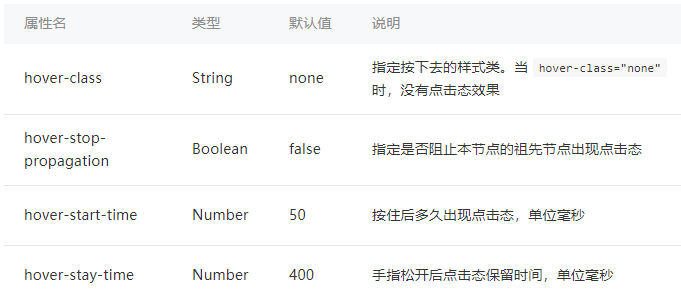
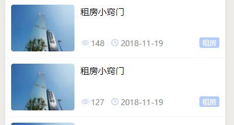
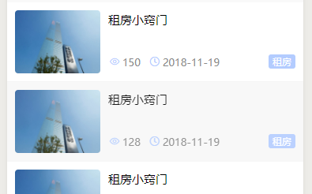
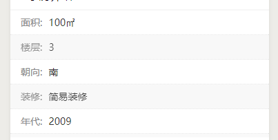
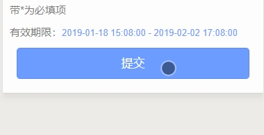
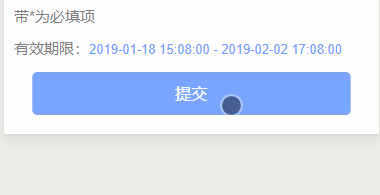
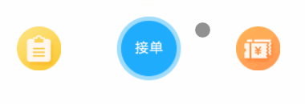

# <Label :level='1'/>小程序设置 hover-class，实现点击态效果

> 增强小程序触感，提高用户交互感知度

### hover-class 介绍

微信小程序中，可以用 hover-class 属性来指定元素的点击态效果。但是在在使用中要注意，大部分组件是不支持该属性的。

- 目前支持 hover-class 属性的组件有三个：view、button、navigator。

- 不支持 hover-class 属性的组件，同时也不支持 hover-stop-propagation、hover-start-time、hover-stay-time 这三个属性。

- 当 hover-class 的值为 none 时，组件上不会有任何点击态效果。



### 注意事项

- hover-class 样式显示的原理是 点击时把样式加到 class 的样式中，冲突时，谁在后面就显示谁!
- 当组件中没有任何指定的类时，直接使用 hover-class 就会起到相应的作用，但是当组件中已经指定了其他可能与 hover-class 冲突的类时，hover-class 无效
- 将 hover-class 指定的类放在对应 wss 文件的最末尾，这样就不会被其他类所覆盖
- 通常，当一个 view 组件中包含 image 等不支持 hover-class 的组件，但又需要在该组件上使用 hover-stop-propagation 属性的作用时，需要将不支持 hover-class 的组件用 view、button 或 navigator 包裹起来

### 使用场景

1. 列表页——详情页（点击跳转）

- 以新闻资讯为例，大部分应该都是这样的



- 添加如下代码

```js{4}
//html
<view hover-class='wsui-btn__hover_list'>
    ...
</view>
//css
.wsui-btn__hover_list {
    opacity: 0.9;
    background: #f7f7f7;
}
```

- 点击效果如下图



2. 展示类表格列表（不触发跳转）

- 可设置 hover-stay-time 属性，突出显示触摸行或列

```js{4}
//html
<view hover-class='wsui-btn__hover_list' hover-stay-time="3000">
    ...
</view>
//css
.wsui-btn__hover_list {
    opacity: 0.9;
    background: #f7f7f7;
}
```



3. 提交类按钮

- 1 种样式往往不能满足，各种形状的按钮，暂提供以下 2 种参考

```js{4}
.wsui-btn__hover_btn {
//圆形按钮
  opacity: 0.9;
  transform: scale(0.95, 0.95);
//长矩形按钮
  position: relative;
  top: 3rpx;
  left: 3rpx;
  box-shadow:0px 0px 8px rgba(0, 0, 0, .1) inset;
}
```





- 上图以长矩形按钮为例，采用 scale 整体缩放效果显然不佳



- 圆形按钮显然更合适

- 对于同页面等待请求返回的按钮，配合 disabled 属性，使用加载中按钮的方案更为合理

4. 有待考量的场景

- 选择类按钮，特指点击切换某些状态，会有及时的状态切换响应的，如遮罩层、active 类
- 导航图标类，首页的图标导航
- 我认为以上无需添加 hover 类

:::warning 特别说明
用户体验是一个值得终身研究的课题

以上只是抛砖引玉，针对点击态，用户体验优化的示例
:::
