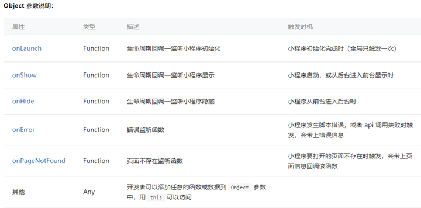
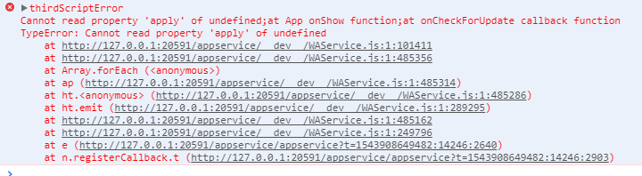
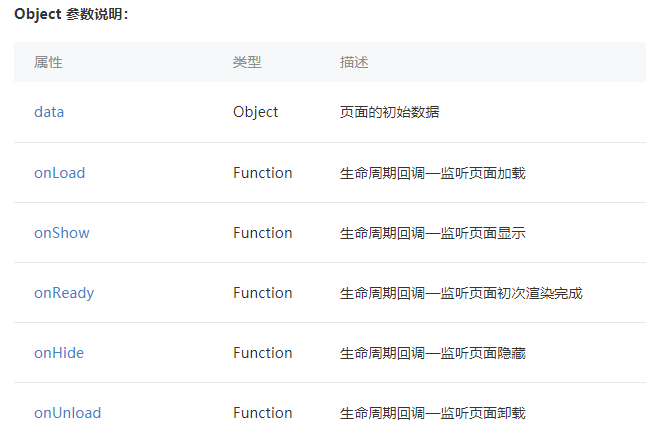
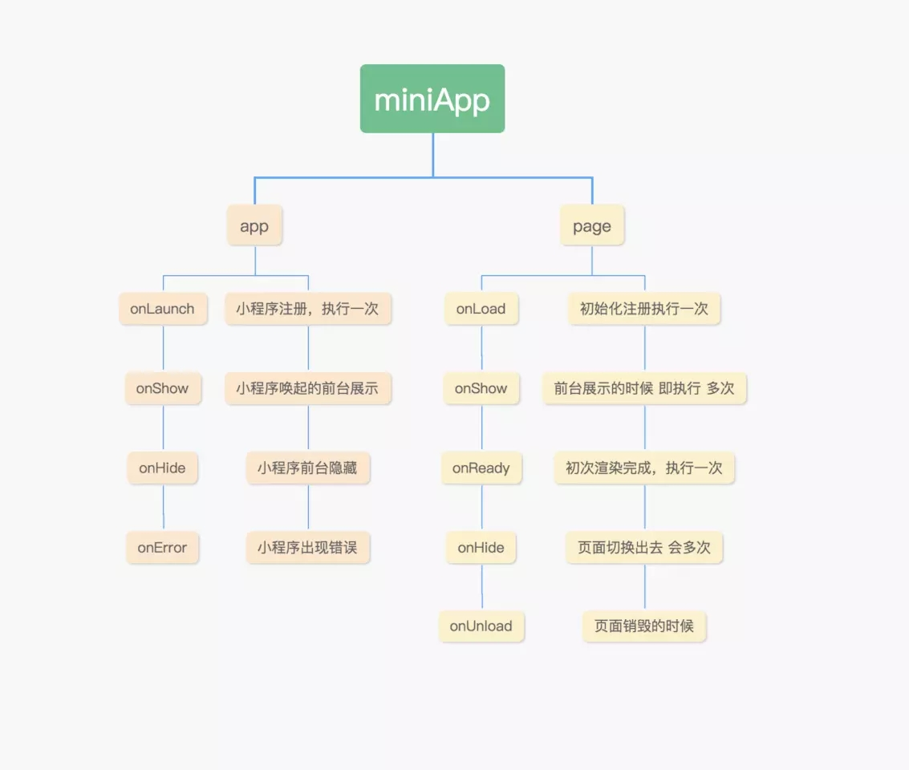
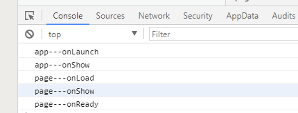
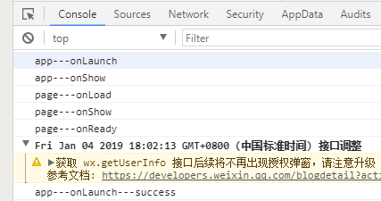

# <Label :level='1'/>小程序生命周期

::: warning 区分
首先小程序的生命周期分App和Page生命周期，需要补知识的->[官方文档](https://developers.weixin.qq.com/miniprogram/dev/framework/app-service/app.html)
:::
## 小程序App生命周期

* 小程序App生命周期是在app.js里面调用的，App(Object)函数用来注册一个小程序，接受一个 Object 参数，指定其小程序的生命周期回调
* App() 必须在 app.js 中调用，必须调用且只能调用一次，不然会出现无法预期的后果



> 以上应该一眼就能看明白，以下主要讲讲前台、后台定义和运行机制等

**1 . 前台、后台定义**

* 当用户点击左上角关闭，或者按了设备 Home 键离开微信，小程序并没有直接销毁，而是进入了后台onHide；当再次进入微信或再次打开小程序，又会从后台进入前台onShow。需要注意的是：只有当小程序进入后台一定时间，或者系统资源占用过高，才会被真正的销毁。

**2 . 运行机制**

* 小程序启动会有两种情况，一种是「冷启动」，一种是「热启动」。 假如用户已经打开过某小程序，然后在一定时间内再次打开该小程序，此时无需重新启动，只需将后台态的小程序切换到前台onShow，这个过程就是热启动；冷启动指的是用户首次打开或小程序被微信主动销毁后再次打开的情况，此时小程序需要重新加载启动onLauch
* 小程序没有重启的概念
* 当小程序进入后台，客户端会维持一段时间的运行状态，超过一定时间后（目前是5分钟）会被微信主动销毁
* 在 iOS 上，当微信客户端在一定时间间隔内（目前是 5 秒）连续收到两次及以上系统内存告警时，会主动进行小程序的销毁，并提示用户 「该小程序可能导致微信响应变慢被终止」。建议小程序在必要时使用 wx.onMemoryWarning 监听内存告警事件，进行必要的内存清理。

**3 . 更新机制**

* 小程序冷启动时如果发现有新版本，将会异步下载新版本的代码包，并同时用客户端本地的包进行启动，即新版本的小程序需要等下一次冷启动才会应用上。 如果需要马上应用最新版本，可以使用 [wx.getUpdateManager API](https://developers.weixin.qq.com/miniprogram/dev/api/wx.getUpdateManager.html) 进行处理
* 小程序强制更新

``` js{4}
//注意，小程序的更新的api需要基础库在1.9.90以上
const updateManager = wx.getUpdateManager()
updateManager.onCheckForUpdate(function (res) {
    // 请求完新版本信息的回调，省略回调会报错，如下图
    console.log(res.hasUpdate)
})
updateManager.onUpdateReady(function () {
    wx.showModal({
        title: '更新提示',
        content: '新版本已经准备好，是否重启应用？',
        success: function (res) {
            if (res.confirm) {
                // 新的版本已经下载好，调用 applyUpdate 应用新版本并重启
                updateManager.applyUpdate()
            }
        }
    })
})
updateManager.onUpdateFailed(function () {
    // 新的版本下载失败
    wx.showModal({
        title: '更新提示',
        content: '新版本下载失败',
        showCancel:false
    })
})
```


**3 . 再次打开逻辑**

* 用户打开小程序的预期有以下两类场景：1、打开首页 2、打开指定页面
* 现在要打开的是首页，如果上一次退出的时候是首页，则保留状态；否则，清空原来的页面栈，打开首页（相当于执行 wx.reLaunch 到首页）
* 现在要打开的是指定页面，不管上次在什么页面，清空原来的页面栈，打开指定页面（相当于执行 wx.reLaunch 到指定页）

## 小程序Page生命周期

* Page(Object) 函数用来注册一个页面。接受一个 Object 类型参数，其指定页面的初始数据、生命周期回调、事件处理函数等


> 引用一张不错的图片来让你一目了然，图片来源于网络


> 补充
#### app.onPageNotFound(Object)
> 基础库 1.9.90 开始支持，低版本需做兼容处理。
* 小程序要打开的页面不存在时触发,也可以使用 wx.onPageNotFound 绑定监听
* 开发者可以在回调中进行页面重定向，但必须在回调中同步处理，异步处理（例如 setTimeout 异步执行）无效
* 主要用于轮播、魔方等动态指定跳转页面的场景，避免出现页面不存在的情况
```
App({
  onPageNotFound(res) {
    // 可以封装一个小程序跳转函数，智能解决tabbar页面跳转的问题
    wx.redirectTo({
      url: 'pages/...'
    })
  }
})
```
## 生命周期执行顺序
::: warning 生命周期执行顺序
分别了解了App和Page的生命周期函数，那他们之间有何关联
:::
*吐槽一句，好多文章说什么app的生命周期函数onLauch可能会在page的onLoad之后触发，搞得我一脸懵逼，说话这么不严谨，真的好吗？？？*
#### 先看看正常的生命周期
``` js{4}
App({
  onLaunch() {
     console.log('app---onLaunch');
  }, 
  onShow() {
    console.log('app---onShow');
  },
  onHide() {
    console.log('app---onHide');
  }
})

Page({

  onLoad(options) {
    console.log('page---onLoad');
  },

  onReady() {
    console.log('page---onReady');
  },

  onShow() {
    console.log('page---onShow');
  },

  onHide() {
    console.log('page---onHide');
  },

  onUnload() {
    console.log('page---onUnload');
  }

})
```
#### 控制台输出



#### 应该说永远是这个顺序，现在再加点代码，就用官方的例子

``` js{4}
App({
  onLaunch() {
     console.log('app---onLaunch');
      // 获取用户信息
    wx.getSetting({
      success: res => {
        if (res.authSetting['scope.userInfo']) {
          // 已经授权，可以直接调用 getUserInfo 获取头像昵称，不会弹框
          wx.getUserInfo({
            success: res => {
              // 可以将 res 发送给后台解码出 unionId
              this.globalData.userInfo = res.userInfo
              console.log('app---onLaunch---success');
              // 由于 getUserInfo 是网络请求，可能会在 Page.onLoad 之后才返回
              // 所以此处加入 callback 以防止这种情况
              if (this.userInfoReadyCallback) {
                this.userInfoReadyCallback(res)
              }
            }
          })
        }
      }
    })
  }
})

Page({
  onLoad(options) {
    console.log('page---onLoad');
    if (app.globalData.userInfo) {
      this.setData({
        userInfo: app.globalData.userInfo,
        hasUserInfo: true
      })
    } else if (this.data.canIUse) {
      // 由于 getUserInfo 是网络请求，可能会在 Page.onLoad 之后才返回
      // 所以此处加入 callback 以防止这种情况
      app.userInfoReadyCallback = res => {
        this.setData({
          userInfo: res.userInfo,
          hasUserInfo: true
        })
      }
    } else {
      // 在没有 open-type=getUserInfo 版本的兼容处理
      wx.getUserInfo({
        success: res => {
          app.globalData.userInfo = res.userInfo
          this.setData({
            userInfo: res.userInfo,
            hasUserInfo: true
          })
        }
      })
    }
  }
})
```
#### 控制台输出



* **可以看出小程序生命周期函数并没有错乱，只是加了异步操作**
* **你永远不知道异步操作会排在正常周期的哪一个位置**

::: tip 解决方案
例子中已经给出了callback的方案，现在也可以使用promise来解决
:::
**1 . callback**
* 解释一波：Page页面判断当前app.globalData.userInfo是否有值
* 如果有，说明异步操作很顺利，当做同步往下操作即可
* 如果没有，则定义一个app方法（回调函数）app.userInfoReadyCallback = res => {...}
* 因为Page.onLoad没有顺利拿到app.globalData.userInfo，说明App页面请求success异步操作滞后了
* 此时APP页面不仅会给globalData.userInfo赋值，还会执行Page页面定义的回调方法，完成业务逻辑
*以上例子是官方对于授权之后的操作流程示例，实际使用替换自己的初始化函数和业务逻辑*

::: danger 注意事项
app.onLaunch全局只触发一次，也就是打开的第一个页面会有异步问题，打开第二个页面肯定是可以拿到初始化数据的，但是小程序可以从不同场景进入，可能打开的并非是首页，这时就需要给每一个可能被第一次就打开的页面，写回调函数，暂时没想到类似vue那种设置全局路由回调的方案
:::
**2 . promise**
* 最终效果应该和回调一样，之前小程序不支持promise，一直没有好好用过，等以后单独研究~

***
## Page实例生命周期
::: tip 先来看一张很熟悉的图
官方原话（以下内容你不需要立马完全弄明白，不过以后它会有帮助）
:::


#### 咋一看，什么鬼，好吧~我听你的，以后再说~
* 转眼间，以后就到啦！好在有大佬解释过了，借花献佛，谁让我是搬运工呢（最后会贴上参考文章链接）
#### Page实例由两大线程组成
* 负责界面的线程（view thread）和服务线程（appservice thread），各司其职又互相配合

* 界面线程有四大状态： 
1. 初始化状态：初始化界面线程所需要的工作，包括工作机制，基本和我们开发者没有关系，等初始化完毕就向 “服务线程”发送初始化完毕信号，然后进入等待传回初始化数据状态

2. 首次渲染状态：收到“服务线程”发来的初始化数据后（就是 json和js中的data数据），就开始渲染小程序界面，渲染完毕后，发送“首次渲染完毕信号”给服务线程，并将页面展示给用户

3. 持续渲染状态：此时界面线程继续一直等待“服务线程”通过this.setdata（）函数发送来的界面数据，只要收到就重新局部渲染，也因此只要更新数据并发送信号，界面就自动更新

4. 结束状态：你懂得

* 服务线程五大状态： 
1. 初始化状态：无需和其他模块交流，跟小程序开发也没多大关联，此阶段就是启动服务线程所需的基本功能，比如信号发送模块。系统的初始化工作完毕，就调用自定义的onload和onshow， 
然后等待界面线程的“界面线程初始化完成”信号。
onload是只会首次渲染的时候执行一次，onshow是每次界面切换都会执行，简单理解，这就是唯一差别
2. 等待激活状态：接收到“界面线程初始化完成”信号后，将初始化数据发送给“界面线程”，等待界面线程完成初次渲染
3. 激活状态：收到界面线程发送来的“首次渲染完成”信号后，就进入激活状态既程序的正常运行状态，并调用自定义的onReady()函数。
此状态下就可以通过 this.setData 函数发送界面数据给界面线程进行局部渲染，更新页面
4. 后台运行状态：如果界面进入后台，服务线程就进入后台运行状态，从目前的官方解读来说，这个状态挺奇怪的，和激活状态是相同的，也可以通过setdata函数更新界面的
## 总结一下
#### 小程序的一生
* 打开小程序 app.onLaunch -> app.onShow -> Page.onLoad -> Page.onShow -> Page.onReady 进入下一个页面 -> Page.onHide -> Next.onLoad -> Next.onShow -> Next.onReady 返回上一个页面 -> Next.onUnload -> Page.onShow 离开小程序 -> app.onHide 再次进入 -> app未销毁 ->app.onShow 否则从头开始（销毁判断看上文运行机制）
#### 只触发一次的，一般都是用来初始化操作
* onLaunch：初始化全局数据，注意异步问题
* onLoad：初始化页面数据
* onReady：代表页面已经准备妥当，界面内容的修改，最好放在这里，如wx.setNavigationBarTitle
* onUnload：不怎么用，都销毁了，该去领盒饭了吧大概
#### 触发多次的，一般用来改变状态
* onShow：刷新
* onHide：重置