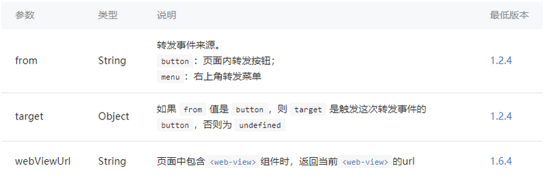
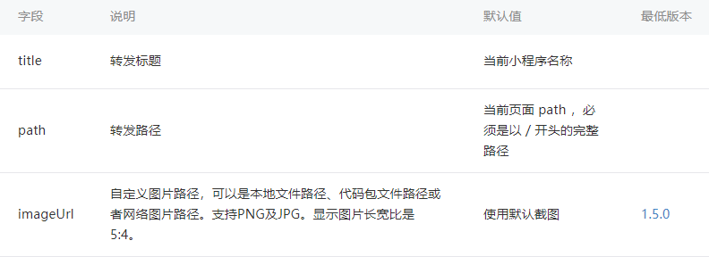
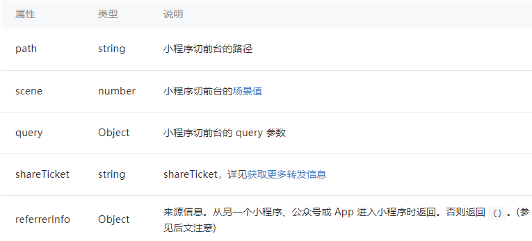
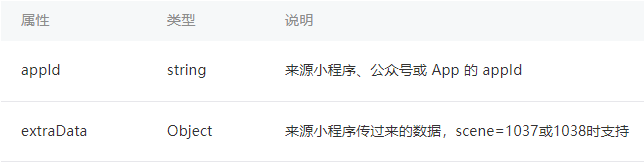
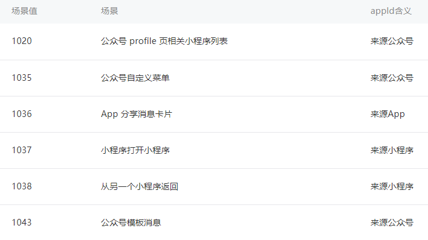
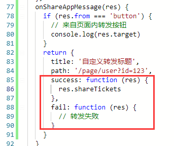

# <Label :level='1'/>小程序转发

### 转发的意义

- 转发即是分享，分享带动了事物去中心化，实现网络化，最终走向云处理化
- 通过微信平台，转发即是聊天
- 流量时代，转发即是引流

### 官方转发示例

**onShareAppMessage(Object)**

- 监听用户点击页面内转发按钮（`<button>` 组件 open-type="share"）或右上角菜单“转发”按钮的行为，并自定义转发内容。

- 注意：只有定义了此事件处理函数，右上角菜单才会显示“转发”按钮

**Object 参数说明：**


此事件需要 return 一个 Object，用于自定义转发内容，返回内容如下：

**自定义转发内容**



```js
Page({
  onShareAppMessage(res) {
    if (res.from === 'button') {
      // 来自页面内转发按钮
      console.log(res.target);
    }
    return {
      title: '自定义转发标题',
      path: '/page/user?id=123'
    };
  }
});
```

**常规转发，只需上面示例即可**

- 在 onShareAppMessage 中定义转发内容和必要参数，如?id=123
- 在相应页面的 onLoad(Object query)中可以获取

### 根据场景值区分

- 对于小程序，可以在 App 的 onLaunch 和 onShow，或 wx.getLaunchOptionsSync 中获取[场景值](https://developers.weixin.qq.com/miniprogram/dev/framework/app-service/scene.html)
- 由于 onLaunch 全局只触发一次和热启动的原因，在 onShow 中获取、设置相关参数比较合理，尤其是转发，从微信消息过来，必然会触发 onShow
- 通过 app.onShow 回调，获取场景值

```js
App({
  onShow(res) {
    console.log('app---onShow');
    console.log(res.scene);
    //1044是群聊，1007是私聊
  }
});
```

**wx.onAppShow(function callback)**

基础库 2.1.2 开始支持，低版本需做兼容处理
监听小程序切前台事件。该事件与 App.onShow 的回调参数一致

**Object res**



**referrerInfo 的结构**



返回有效 referrerInfo 的场景



> 注意
> 部分版本在无 referrerInfo 的时候会返回 undefined，建议使用 options.referrerInfo && options.referrerInfo.appId 进行判断

### 小程序分享票据 shareTickets

通常开发者希望转发出去的小程序被二次打开的时候能够获取到一些信息，例如群的标识。现在通过调用 wx.showShareMenu 并且设置 withShareTicket 为 true ，当用户将小程序转发到任一群聊之后，此转发卡片在群聊中被其他用户打开时，可以在 App.onLaunch 或 App.onShow 获取到一个 shareTicket。通过调用 wx.getShareInfo() 接口传入此 shareTicket 可以获取到转发信息。

- 和场景值 scene 一样，shareTicket 也是在 App.onShow 中获取比较合理
- **必须在分享前调用 wx.showShareMenu 方法，否则不会带分享票据**

```
//分享前share.js
Page({
  onLoad: function () {
    wx.showShareMenu({
      withShareTicket: true
    })
  }
})
//分享后app.js
App({
  onShow(res) {
    console.log('app---onShow');
    console.log(res.shareTicket);
  }
})
```

- 只有分享到任一群聊，shareTicket 才会有值，否则是 undefined
- shareTicket 也可以用来区分转发消息的场景
- shareTicket 主要用来获取转发详情，传入 wx.getShareInfo()中获取加密数据，需要后端配合，返回解密数据
  > 注意：注意：注意
  > 鉴于官方“分享监听”能力调整，网上 90%的滞后代码，误人子弟（吐槽一下度娘已死，没人打我吧？打我就删除）

类似如下代码，现在已不支持回调



**此次调整可能影响到三种分享功能的用法**

- 第一种:判断用户是否分享成功，进而给予用户奖励。

  例如：小程序提示用户“分享到 5 个群，可以获得一张 20 元的优惠券”。

  这类诱导用户分享的行为是我们平台所不倡导的，后续将没有办法实现。

- 第二种:分享完成后变更当前的页面状态

  例如：赠送礼品场景下，用户点击“赠送”按钮，将礼品分享出去，分享成功后，界面展示“等待领取”。

  这类场景，我们建议可以适当调整交互方案。例如在分享后继续保留“赠送”按钮，但在页面上提示用户一个礼品只能被一人领取，重复赠送无效。

- 第三种：通过用户分享之后的 shareTicket 获取群唯一标识 openGId ，以显示对应群的相关信息。

  例如：通过分享小程序到某个群里，可以查看该群内成员的排行榜。

此次调整后，用户分享完成后无法立刻显示该群的排行榜信息，但仍可在用户从群消息点击进入小程序时显示该群的排行榜信息。

- 详情请查看 [分享监听能力调整](https://developers.weixin.qq.com/community/develop/doc/0000447a5b431807af57249a551408)

### 转发动态消息

从基础库 2.4.0 开始，支持转发动态消息。动态消息对比普通消息，有以下特点：

- 消息发出去之后，开发者可以通过后台接口修改部分消息内容
- 消息有对应的提醒按钮，用户点击提醒按钮可以订阅提醒，开发者可以通过后台修改消息状态并推送一次提醒消息给订阅了提醒的用户

**简要步骤如下**

1. （后端调用）每条动态消息可以理解为一个活动，活动发起前需要通过 createActivityId 接口创建 activity_id 后续转发动态消息以及更新动态消息都需要传入这个 activity_id
2. 通过调用 wx.updateShareMenu 接口，传入 isUpdatableMessage: true 等参数
3. （后端调用）动态消息发出去之后，可以通过 setUpdatableMsg 修改消息内容

**像拼团这样的活动，可以考虑优化成动态消息，需要后端配合，实战的时再补充**

### 总结

- 分享监听能力调整后，对于分享的骚操作基本在 App.onShow 中进行，相当于授权那样，必须打开转发消息才能获取转发详情，这也是符合设计准则的
- 可以看出，不管是从设计准则，还是用户隐私，微信都在向着 IOS 看齐，黑暗法则已过去，我们也该注重规范和隐私了
