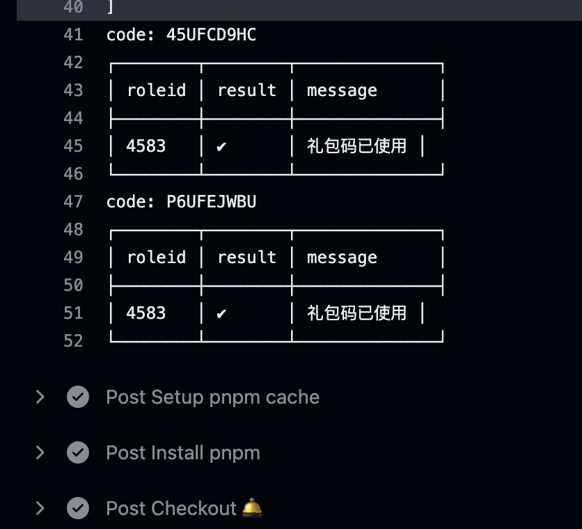

# <Label :level='1'/> Node 实战《梦幻模拟战礼包兑换》实现思路

::: tip 麻雀虽小，五脏俱全

- 以一位小前端的视角展开，在已有一些积累的情况下，依然挺费劲的
- 万事开头难，隔行如隔山，都告诉我们对小白来说简单的事情不简单
  :::

## 准备工作及技术栈

- 小程序
- Nodejs + Koa2 + TypeOrm + Mysql
- githubActions + Bark
- 阿里云服务器

## 业务流程

1. 小程序登记游戏 id 信息 => 保存到云服务器
2. Node 起后端服务将数据保存到 Mysql 数据库
3. Node 通过谷歌无头浏览器爬取最新礼包码，并缓存
4. diff 比较差异后，无差异不执行，有差异用新的礼包码为全部用户发起请求兑换
5. 每次执行后用 Bark 推送关键信息到 ios 手机
6. 开启定时任务，每天定点执行一次

学习之余，搞了个公众号，小程序一条龙，但是个人版限制太多了，基本啥功能都审核不过，于是为爱发电吧，不用授权登录，直接登记一下游戏 id 即可，自动兑换礼包码和周二转盘

直接按图操作吧： 1.扫二维码去我公众号，如果点个关注就更好啦（本职是前端，AI 是业余爱好，但是 AI 正在风口浪尖推荐大家学一学看一看）

3.不需要授权登录，可以直接填写，再次进来有默认信息就可以了，注意事项说了 id 是采用的合服真实 id 所以会显示被合入的主服务器哦 4.因为个人小程序不能长期订阅消息，所以无法给你们发消息通知，也可能并不需要这个功能，放心我是有记录的，你们只要保证 id 和区服没搞错，
然后等哪一天有码的时候第二天 10 点进游戏看有没有获得就行，我本地用了很久了，应该没问题。 5.以上就是每天早上 10 点跑一次，会打印兑换信息 6.同时我也将关键信息，通过 ios 免费的推送 app：Bark 发送给我自己了，如下图，如果挂了我会去看，毕竟买的垃圾玩具服务器，感谢支持（不乱搞，仅学习和带来一点点便利，如果想讨论技术也可以微信找我，但我很菜的）
