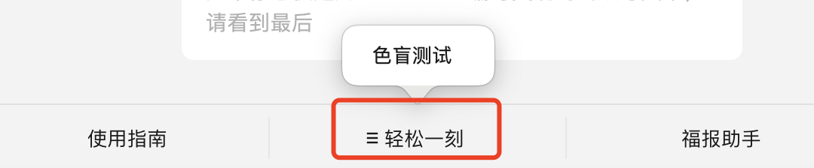

# <Label :level='1'/> 浅谈个人开发者的自媒体整活之路，以 Node 实战《游戏礼包码兑换》简单实现思路为例

::: tip 麻雀虽小，五脏俱全

- 简单讲讲整体思路，如有问题，可私信或留言交流，卖课培训的不要找我，水军互粉也别找我
- 其实一直想有一个自己的“王国”这个不知道怎么表达确切，大概就是想有一个自己的网站，一个自己的公众号，一个自己的小程序，一个自己的 app，其实之前也做过尝试，因为忙因为懒因为繁琐因为没有回报，总之各种原因没有实现
- 好在算是有点积累，那就现在开始
  :::

## 整活准备工作

一切都是为了整活和丰富自己，于是申请了微信一条龙：公众号（这个 2020 年就申请了搁置到现在）+小程序+视频号，还有云服务器，都是最低配置个人版，你别说茫茫多的实名、认证、备案，挺繁琐的，限制还多，很多做了的功能审核不通过只能删除。

既然是个人版，我们的定位很明确：**【免费】【白嫖】【低配】**，所以小程序里的工具和小游戏一定是免费的，能白嫖其他的服务 api 一定是白嫖的哈哈，但肯定要是好玩的，有意义的，我就在时刻思考做什么，可以留言给我点灵感

## 浅谈个人开发者的自媒体整活之路

- 首先目的是以学习、思考、分享的方式沉淀一些东西出来；
- 或者用技术做一点免费好玩或便利性的东西；
- 试图将工作+生活+游戏+自媒体，更好的结合起来，看看能不能产生化学效应

因为还是全职工作 ing，最近每天下班整活，还挺累的，而且 0 收益，自媒体水也深，似乎不上手段不行，但绝不买水军，就要硬着头皮摸着石头过河【此处有狗头】
**公众号**
目前公众号嘛继续写文章输出咯，但我很贪心，就不垂直领域，会一边写技术类，一边写成长类，一边写 AI 方面

**小程序**
小程序打算做一些解压小游戏，放在这里

**视频号**
视频号其实我开通收益了，但是没人带节奏没有评论就没有广告就没有收益，停更了等有空再思考，难道要我下海擦边吗哈哈

接下来介绍用 node 做的小脚本，它为我增加了 100+关注，这应该算成功案例了吧，感谢各位的关注～

## 业务流程大纲

1. 小程序登记游戏 id 信息 => 保存到云服务器
2. Node 起后端服务将数据保存到 Mysql 数据库
3. Node 通过谷歌无头浏览器爬取最新礼包码，并缓存
4. diff 比较差异后，无差异不执行，有差异用新的礼包码为全部用户发起请求兑换
5. 每次执行后用 Bark 推送关键信息到 ios 手机
6. 开启定时任务，每天定点执行一次

## 按实际代码分部介绍

### 第一部分

就是写一个小程序表单页面，来收集游戏 id；
静默登录，不需要授权微信的隐私信息；
就用微信的唯一标记 openid，提交信息到云服务器；

### 第二部分

使用 NodeJs 语言启动 web 服务，通过 TypeOrm 将对象关系映射到 Mysql 数据库，
然后就能把小程序提交过来的信息保存到数据库

### 第三部分

- 包括了业务中 3 ～ 6
- 在另外一个 node 服务中，通过谷歌无头浏览器爬取 B 站 wiki 大佬维护的礼包码（感恩这些为爱发电的好人），然后缓存
- 每次都和缓存 diff 比较差异后，无差异不执行，有差异用新的礼包码为全部用户发起请求兑换，这一步可以不做，属于优化
- 每次执行后，也会有很多处理函数来处理整合美化数据（细节处理不展开），我用免费的 Bark 推送关键信息到 我的 ios 手机
- 开启定时任务，每天定点执行一次，虽然可以在云服务器做这个，但是这边是采用白嫖 githubActions 的方式，附个[GitHub Actions 文档](https://docs.github.com/zh/actions)(https://docs.github.com/zh/actions)

## 闲聊

这是一个前端野路子，疯狂生长的路上需要沉淀，分享是我沉淀成长的方式，而您的关注反馈是我所需的养分，希望互励共勉一起成长！
