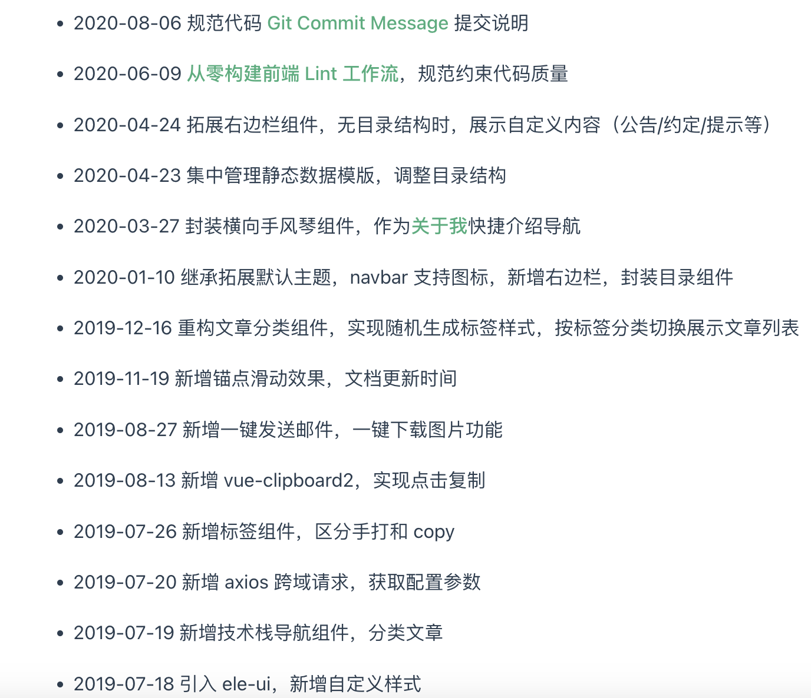
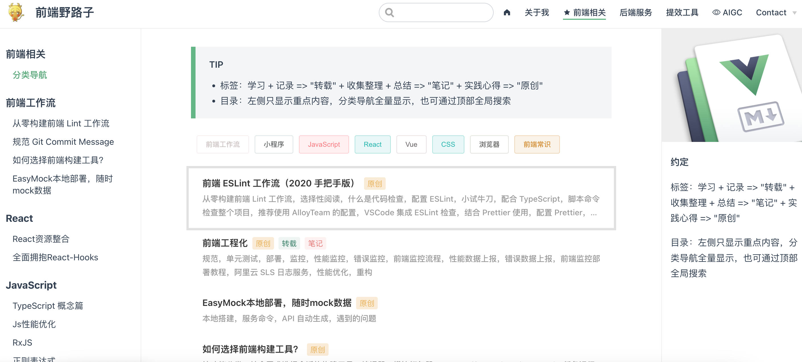
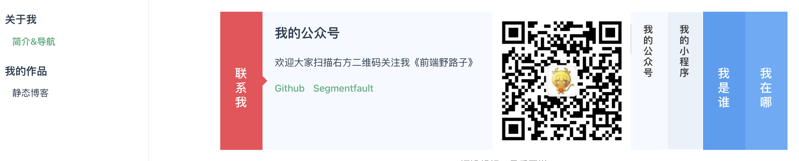
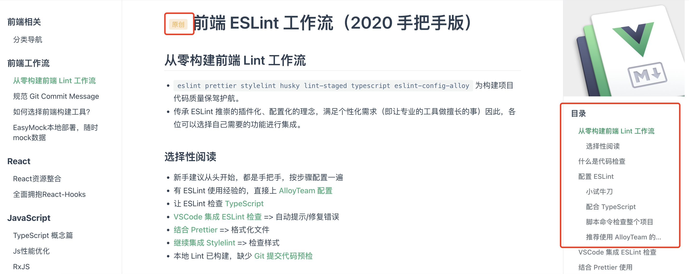

# <Label :level='1'/> Vuepress 静态博客搭建

静态博客作为文章孵化池，再合适不过，markdown 格式既方便又美观，Vuepress 还支持很多扩展功能，还能一键部署到 github 无需服务器，随时查看

## 快速开始

- [在线查看我的博客](https://soonerorlater-newbest.github.io/)
- 贴一下[官方文档](https://vuepress.vuejs.org/zh/guide/)，想拓展可以查看
- 克隆我的项目开始

```bash
git clone https://github.com/SoonerOrLater-NewBest/blog-zzc.git
```

- 如何使用，可以直接看[github 项目中的 Readme](https://github.com/SoonerOrLater-NewBest/blog-zzc)

## 比默认主题多了什么



- 大概就是覆盖了部分默认主题的结构
- 引入了一些组件和样式注册到了全局
- 自定义了一些全局组件
- 界面是这样的







- 还有很多可以自己看源码，如果有必要和时间，后续也会写到项目 Readme 中

## 重要提示

- copy 使用时，切记删除`docs`中除了`.vuepress`的其他文件，不要把我文章一起拷贝发布。。。
- 给我点个 star，让我有动力继续开发好看的自定义组件，不甚感激，本文完！
